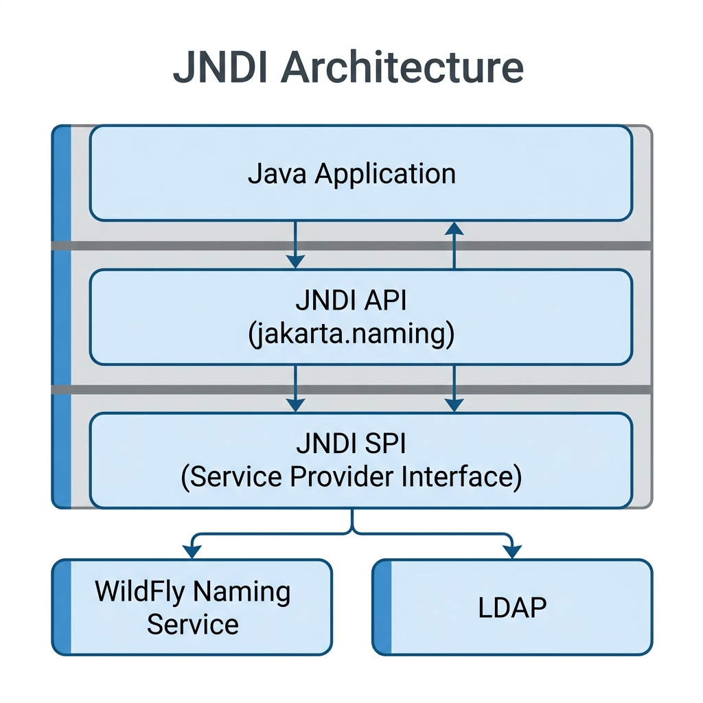
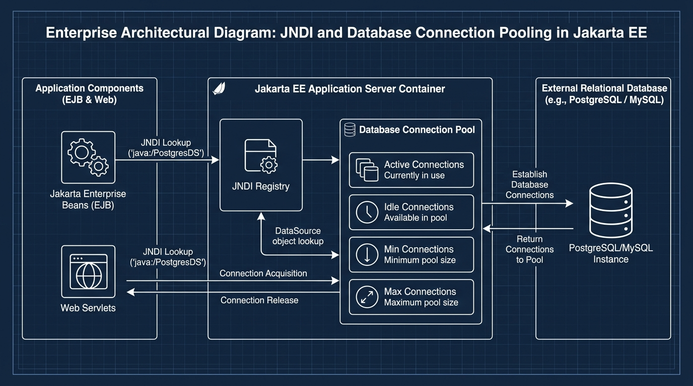

# Session 3 — Resource Creation in Jakarta Enterprise Beans
## Theory Guide

**Course:** Enterprise Application Development in Jakarta EE
**TL Session:** TL1 (Session 3)
**Prerequisites:** Sessions 1 & 2 — Introduction to Jakarta EJBs and Session Bean Types

---

## Learning Objectives

By the end of this session, you will be able to:
- ✅ Define what a "Resource" is in Jakarta EE and explain how JNDI provides naming services
- ✅ Explain the three JNDI namespaces (`java:global`, `java:module`, `java:app`)
- ✅ Describe what a DataSource is and how connection pooling works
- ✅ Explain how resources are created and registered administratively in WildFly

---

## 3.1 — What is a "Resource" in Jakarta EE?

### Real-World Analogy First

Think about a large office building — say, a **bank headquarters**. Inside this building, there are hundreds of employees (application components). Each employee needs access to shared resources such as:
- The **printer room** (database)
- The **mailroom** (message queue)
- The **meeting rooms** (connection pools)

Now, if every employee had to **find** and **manage** these resources on their own, chaos would result. Instead, the company uses a **directory** — a central registry that tells everyone: *"The printer is on Floor 3, Room 301. The mailroom is in the basement, Room B2."*

In Jakarta EE, that central directory is called **JNDI — the Java Naming and Directory Interface**.

A **Resource** in Jakarta EE is any external service or object that an application component (like an EJB) needs to use — most commonly:
- **Databases** (via JDBC DataSources)
- **Message Queues** (via JMS)
- **Mail sessions** (for sending emails)
- **Connection Pools** (reusable database connections)

---

## 3.2 — JNDI: The Address Book of Jakarta EE

### What is JNDI?

**JNDI (Java Naming and Directory Interface)** is an API that is built into the Jakarta EE specification. It acts as a **central address book (or phone directory)** that maps simple names to actual objects living on the application server.

Think of it this way:
- Without JNDI: A client must know the exact memory address or location of every bean or resource — impossible in distributed systems.
- With JNDI: The client just looks up a name like `"jdbc/GlobalBankDB"` and JNDI returns the actual database connection object. The client does not need to know *where* the database is or how to connect to it.

```
┌────────────────────────────────────────────────────────────────┐
│                    JNDI DIRECTORY (The Address Book)          │
├──────────────────────────────────┬─────────────────────────────┤
│  JNDI Name (The "Phone Number")  │  Actual Object (The "Person")│
├──────────────────────────────────┼─────────────────────────────┤
│  java:global/MyApp/AccountBean   │  AccountBean EJB instance   │
│  jdbc/GlobalBankDB               │  PostgreSQL DataSource      │
│  jms/TransactionQueue            │  JMS Queue object           │
└──────────────────────────────────┴─────────────────────────────┘
```

---

### JNDI Architecture

Your application sits on top of a **two-part** JNDI architecture — the **API** you call
(`javax.naming`) and the **SPI** the server vendor implements underneath it:



> 📌 **Key Point**: Your application code uses the **JNDI API** layer only. You never call WildFly-specific code. This means if your company switches from WildFly to WebLogic, your JNDI lookup code does NOT change. Only the SPI layer (handled by the server vendor) changes.

---

### The Three JNDI Namespaces

JNDI organizes names into namespaces — think of these like different sections of the phone directory.

#### 1. `java:global` — The Global Namespace

This is the **widest** namespace. Objects registered here can be accessed by **any** application, module, or client anywhere on the server.

**Format:**
```
java:global[/application-name]/module-name/bean-class-name[/interface-name]
```

**Example:** Accessing the `AccountBean` from the GlobalBank application:
```
java:global/GlobalBankApp/AccountEJB/AccountBean!com.globalbank.AccountRemote
```

Let's break that name down piece by piece:

| Segment | Meaning |
|---|---|
| `java:global` | Tells JNDI this is a global lookup |
| `/GlobalBankApp` | The EAR application name |
| `/AccountEJB` | The EJB module (JAR file name) |
| `/AccountBean` | The name of the bean class |
| `!com.globalbank.AccountRemote` | The specific remote interface to use |

---

#### 2. `java:module` — The Module Namespace

This is **narrower** — only beans within the **same EJB module (JAR)** can use this namespace to find each other.

**Format:**
```
java:module/bean-class-name[/interface-name]
```

**Example:** A bean inside AccountEJB.jar looking up another bean in the same JAR:
```
java:module/AccountBean!com.globalbank.AccountLocal
```

> 💡 **Analogy**: `java:module` is like an internal company phone extension — only colleagues in the same building can use it.

---

#### 3. `java:app` — The Application Namespace

This is between the two extremes. It allows beans **within the same EAR application** (but potentially in different EJB modules) to find each other.

**Format:**
```
java:app[/module-name]/bean-class-name[/interface-name]
```

**Example:** A web module inside GlobalBankApp looking up a bean in AccountEJB.jar:
```
java:app/AccountEJB/AccountBean!com.globalbank.AccountLocal
```

---

### Summary Table: The Three Namespaces

```
┌──────────────────┬──────────────────┬───────────────────────────────────────┐
│ Namespace        │ Scope            │ Accessible From                       │
├──────────────────┼──────────────────┼───────────────────────────────────────┤
│ java:global      │ Server-wide      │ Any application, any module, any client│
│ java:app         │ Application-wide │ Any module within the same EAR app    │
│ java:module      │ Module-only      │ Only beans in the same JAR/WAR module │
└──────────────────┴──────────────────┴───────────────────────────────────────┘
```

---

### The `InitialContext` Class — Your Entry Point to JNDI

Before you can look up anything in JNDI, you need to get a "handle" to the JNDI directory. This is done using the `InitialContext` class.

```java
// Step 1: Create an InitialContext — this connects you to the JNDI directory
Context ctx = new InitialContext();

// Step 2: Use the lookup() method with a JNDI name to get the actual object
AccountRemote account = (AccountRemote) ctx.lookup(
    "java:global/GlobalBankApp/AccountEJB/AccountBean!com.globalbank.AccountRemote"
);

// Step 3: Now use the object just like a normal Java object
double balance = account.getBalance(12345);
```

**Line-by-line explanation:**
- `new InitialContext()` — Creates a connection to the JNDI service running on WildFly. Think of it as "opening the phone directory."
- `ctx.lookup("name")` — Looks up the name in the JNDI directory and returns whatever object is registered under that name. Think of it as "looking up a phone number."
- The cast `(AccountRemote)` — JNDI returns a generic `Object`, so we tell Java what type we are expecting.

---

### The `Context` Interface — What You Can Do in JNDI

The `Context` interface provides the following key methods:

| Method | What It Does | Real-World Analogy |
|---|---|---|
| `ctx.lookup("name")` | Finds and returns the object with that JNDI name | Looking up a number in the phone book |
| `ctx.bind("name", object)` | Registers a new name → object mapping | Adding a new entry to the phone book |
| `ctx.rebind("name", object)` | Replaces an existing mapping | Updating a phone number in the book |
| `ctx.unbind("name")` | Removes a JNDI name → object mapping | Removing a listing from the phone book |

> ⚠️ **Note for students**: In practice, you almost never call `bind()` or `unbind()` yourself. The application server (WildFly) does this automatically when you deploy your EJBs. As an application developer, your primary job is to call `lookup()`.

---

### Advantages of JNDI

✅ **Portability**: Write your JNDI lookup code once — it works across different application servers.

✅ **Location Transparency**: Your code doesn't need to know WHERE the resource is (which machine, which port). JNDI handles this.

✅ **Decoupling**: The client code is decoupled from the actual implementation. Today the database might be PostgreSQL; tomorrow it might be Oracle. Your JNDI lookup code stays the same.

✅ **Standard**: It is part of the Jakarta EE specification, so all compliant servers support it.

---

### Limitations of JNDI

❌ **Not designed for high-performance environments**: JNDI lookups can be slow. In performance-critical code, you should cache the result of a lookup instead of calling it every time.

❌ **Limited data types**: JNDI can only store specific types of objects. It is not a general-purpose data store for configuration data.

❌ **No built-in transactions**: JNDI itself does not manage transactions.

❌ **No built-in security**: JNDI has no security model of its own (though some implementations add SSL support).

---

## 3.3 — DataSource, Objects, and Connection Pools

### The Problem: Database Connections Are Expensive

Imagine you own a bank, and every time a teller needed to serve a customer, they had to:
1. Call the bank's IT department
2. Wait for them to set up a new phone line to the database server
3. Complete the transaction
4. Hang up and disconnect the phone line

That would be absurdly slow! Yet this is exactly what happens with a **physical database connection** — establishing one takes time (network handshake, authentication, protocol setup — typically 200ms–2000ms).

A bank might have 500 customers per minute. If each one required a new database connection, the application would grind to a halt.

The solution is **Connection Pooling**.

---

### What is a DataSource?

A **DataSource** is a Jakarta EE object that represents a **factory for database connections**. Instead of connecting to the database directly using `DriverManager`, your code asks the DataSource for a connection.

```
WITHOUT DataSource (Bad Practice — Never do this in Enterprise Apps):
──────────────────────────────────────────────────────────────────
String url = "jdbc:postgresql://localhost:5432/globalbank";
Connection conn = DriverManager.getConnection(url, "user", "pass");
// ^^ This creates a NEW physical connection every single time!
// Extremely slow in production.

WITH DataSource (The Correct Jakarta EE Way):
──────────────────────────────────────────────────────────────────
// The DataSource is registered in JNDI by the server admin
Context ctx = new InitialContext();
DataSource ds = (DataSource) ctx.lookup("jdbc/GlobalBankDB");
Connection conn = ds.getConnection();
// ^^ This retrieves a PRE-EXISTING connection from the pool!
// Extremely fast.
```

---

### What is Connection Pooling?

**Connection pooling** is the technique of keeping a "pool" of pre-established database connections ready so that application code can grab one when needed and return it when done — without the cost of creating a new physical connection each time.



---

### Step-by-Step: How to Configure a DataSource in WildFly (Administrative)

This is how a database administrator (or senior developer) sets up a DataSource so the application can find it via JNDI.

#### Method 1: Using the WildFly Admin Console (Graphical)

**Step 1**: Start your WildFly server and open your browser.

**Step 2**: Navigate to the Admin Console:
```
http://localhost:9990/console
```
Log in with the admin credentials you created during setup.

**Step 3**: In the left navigation panel, click:
```
Configuration → Subsystems → Datasources & Drivers → Datasources
```

**Step 4**: Click **Add** (the "+" button). A wizard will open.

**Step 5**: Fill in the wizard fields:

*Page 1 — Choose Type:*
- Select **Non-XA Datasource** (for simple single-database transactions)
- Click **Next**

*Page 2 — Datasource Attributes:*

| Field | Value to Enter |
|---|---|
| **Name** | `GlobalBankDS` |
| **JNDI Name** | `java:/jdbc/GlobalBankDB` |
| Click **Next** | |

*Page 3 — JDBC Driver:*
- If PostgreSQL driver is listed, select it.
- If not, you must first deploy the PostgreSQL JDBC driver JAR. (See below.)
- Click **Next**

*Page 4 — Connection Settings:*

| Field | Value |
|---|---|
| **Connection URL** | `jdbc:postgresql://localhost:5432/globalbank` |
| **Username** | `globalbank_user` |
| **Password** | `your_password` |

**Step 6**: Click **Test Connection**. You should see:
```
✅ Successfully connected to the database!
```

**Step 7**: Click **Finish**.

> ✅ **Result**: WildFly has now created the DataSource and registered it in JNDI under the name `java:/jdbc/GlobalBankDB`. Your EJBs can now look it up.

---

#### Method 2: Using WildFly CLI (Command Line — for automation/scripts)

```bash
# Connect to the WildFly management CLI
$WILDFLY_HOME/bin/jboss-cli.sh --connect

# Add the PostgreSQL DataSource
/subsystem=datasources/data-source=GlobalBankDS:add(\
  jndi-name="java:/jdbc/GlobalBankDB",\
  driver-name="postgresql",\
  connection-url="jdbc:postgresql://localhost:5432/globalbank",\
  user-name="globalbank_user",\
  password="your_password",\
  min-pool-size=5,\
  max-pool-size=20\
)

# Reload the server to apply changes
reload
```

---

### How Your EJB Uses the DataSource

Once the DataSource is configured in WildFly, any EJB can access it using the `@Resource` injection annotation (the clean, modern way) or via JNDI lookup.

**Method A — Using `@Resource` Annotation (Recommended)**:

```java
package com.globalbank.ejb;

import jakarta.annotation.Resource;
import jakarta.ejb.Stateless;
import javax.sql.DataSource;
import java.sql.Connection;
import java.sql.PreparedStatement;
import java.sql.ResultSet;

@Stateless
public class AccountBean implements AccountRemote {

    // ① Tell the container: "Inject the DataSource registered at this JNDI name"
    // The container handles the JNDI lookup for us — no manual InitialContext needed!
    @Resource(lookup = "java:/jdbc/GlobalBankDB")
    private DataSource globalBankDS;
    
    @Override
    public double getBalance(int accountId) {
        // ② Get a connection from the pool
        // NOTE: We use try-with-resources to guarantee the connection is ALWAYS returned
        try (Connection conn = globalBankDS.getConnection();
             PreparedStatement stmt = conn.prepareStatement(
                 "SELECT balance FROM accounts WHERE account_id = ?"
             )) {
            
            // ③ Set the query parameter (prevents SQL injection!)
            stmt.setInt(1, accountId);
            
            // ④ Execute the query
            ResultSet rs = stmt.executeQuery();
            
            if (rs.next()) {
                return rs.getDouble("balance");
            }
            
            return 0.0; // Account not found
            
        } catch (Exception e) {
            // ⑤ Log the error and rethrow as a runtime exception
            throw new RuntimeException("Could not retrieve balance: " + e.getMessage(), e);
        }
        // ⑥ The try-with-resources block AUTOMATICALLY calls conn.close()
        //    which RETURNS the connection to the pool — NOT closes it!
    }
}
```

**Line-by-line explanation of `@Resource`**:
- `@Resource(lookup = "java:/jdbc/GlobalBankDB")` — This tells the EJB container: "Before this bean is ready to use, please look up the DataSource at this JNDI name and inject it into this field." The container does this automatically.
- `private DataSource globalBankDS;` — The DataSource object is stored here. The container fills this in.
- `try (Connection conn = globalBankDS.getConnection())` — We ask the DataSource for a connection. If one is available in the pool, we get it instantly. The `try-with-resources` syntax ensures the connection is automatically returned to the pool when we are done.

---

**Method B — Using Manual JNDI Lookup (Alternative)**:

```java
Context ctx = new InitialContext();
DataSource ds = (DataSource) ctx.lookup("java:/jdbc/GlobalBankDB");
Connection conn = ds.getConnection();
```

> 💡 The `@Resource` method (Method A) is preferred because it is cleaner, the container handles errors, and the code is more readable.

---

## 3.4 — Creating Resources Administratively: The `application.xml` Approach

### What is `application.xml`?

When you package an enterprise application into an EAR (Enterprise Archive) file, you can include a file called `application.xml` inside the `META-INF` folder. This file tells the application server about the resources your application needs.

### The Standard Resource Descriptor Elements

The `application.xml` (or `web.xml` for web applications) uses the following XML elements to declare resources:

#### `<env-entry>` — Simple Configuration Values

Use this for simple string or numeric configuration values that you want to look up from JNDI at runtime.

```xml
<!-- application.xml (or web.xml) -->
<env-entry>
  <env-entry-name>maxTransferLimit</env-entry-name>
  <env-entry-type>java.lang.Double</env-entry-type>
  <env-entry-value>50000.00</env-entry-value>
</env-entry>
```

Now in your EJB, you can look this up:
```java
@Resource(name = "maxTransferLimit")
private Double maxTransferLimit;
```

**Why use this?** If the bank needs to change the maximum transfer limit from $50,000 to $100,000, the IT team just updates the XML file and redeploys — **no code changes needed**.

---

#### `<resource-ref>` — References to Resource Factories (like DataSources)

This declares that your application needs a resource factory — most commonly a JDBC DataSource or a JMS connection factory.

```xml
<resource-ref>
  <res-ref-name>jdbc/GlobalBankDB</res-ref-name>
  <res-type>javax.sql.DataSource</res-type>
  <res-auth>Container</res-auth>
</resource-ref>
```

| XML Element | Meaning |
|---|---|
| `<res-ref-name>` | The JNDI name your code uses to look up the resource |
| `<res-type>` | The Java type of the resource |
| `<res-auth>` | Who handles authentication: `Container` (WildFly) or `Application` (your code) |

---

#### `<resource-env-ref>` — Environment References without Authentication

Introduced in Servlet 2.4. Use this for resources that do not require login credentials — for example, a JMS queue or a mail session.

```xml
<resource-env-ref>
  <resource-env-ref-name>jms/TransactionQueue</resource-env-ref-name>
  <resource-env-ref-type>jakarta.jms.Queue</resource-env-ref-type>
</resource-env-ref>
```

---

### Complete Working Example — JNDI UpperCase Demo (from Textbook)

Now let's walk through the complete textbook example that demonstrates JNDI lookup with a Servlet client. This shows how a web component (Servlet) accesses an EJB via JNDI.

#### Step 1: The Remote Interface

```java
// File: UpperCaseRemote.java
package demo.jndi;

import jakarta.ejb.Remote;

/**
 * Remote interface for the UpperCase bean.
 * ANY remote client (including Servlets in other modules) can call sayHello()
 * because it is declared through the @Remote interface.
 */
@Remote
public interface UpperCaseRemote {
    public StringBuffer sayHello();
}
```

---

#### Step 2: The Stateless Session Bean

```java
// File: UpperCase.java
package demo.jndi;

import jakarta.ejb.LocalBean;
import jakarta.ejb.Stateless;

/**
 * UpperCase Bean — A Stateless Session Bean that converts lowercase to uppercase.
 *
 * @Stateless: Because each conversion is independent — no need to remember
 *             what the previous call converted.
 *
 * mappedName = "Upper": This is an optional hint to the server about what
 *             JNDI name to use. Actual name depends on server configuration.
 *
 * @LocalBean: This bean also exposes a no-interface local view,
 *             meaning it can also be called from within the same module.
 */
@Stateless(mappedName = "Upper")
@LocalBean
public class UpperCase implements UpperCaseRemote {

    public UpperCase() {
        // Required no-arg constructor for the EJB container
    }

    @Override
    public StringBuffer sayHello() {
        // ① Start with the hardcoded string (in a real app this would be a parameter)
        String string1 = "hello jndi";
        
        // ② Create a mutable StringBuffer from the original string
        //    StringBuffer is like a String but can be modified character-by-character
        StringBuffer updatesString = new StringBuffer(string1);
        
        // ③ Loop through each character in the original string
        for (int i = 0; i < string1.length(); i++) {
            
            if (Character.isLowerCase(string1.charAt(i))) {
                // If this character is lowercase (e.g., 'h') → convert to uppercase 'H'
                updatesString.setCharAt(i, Character.toUpperCase(string1.charAt(i)));
                
            } else if (Character.isUpperCase(string1.charAt(i))) {
                // If this character is uppercase → convert to lowercase
                // (handles mixed-case inputs)
                updatesString.setCharAt(i, Character.toLowerCase(string1.charAt(i)));
            }
            // If it is a space or special character, leave it unchanged
        }
        
        // ④ Print to the server log (visible in WildFly console)
        System.out.println("String : " + updatesString);
        
        // ⑤ Return the converted string as a StringBuffer
        return updatesString;
    }
}
```

**Expected result of this method:**
- Input: `"hello jndi"`
- Output: `"HELLO JNDI"`

---

#### Step 3: The Servlet Client (Remote JNDI Access)

```java
// File: UppercaseDemo.java
package uppercase.jndi;

import java.io.IOException;
import java.io.PrintWriter;

import javax.naming.InitialContext;   // NOTE: JNDI stays under javax.naming even in Jakarta EE 9+
import javax.naming.NamingException;  //       there is NO jakarta.naming package
import jakarta.servlet.ServletException;
import jakarta.servlet.annotation.WebServlet;
import jakarta.servlet.http.HttpServlet;
import jakarta.servlet.http.HttpServletRequest;
import jakarta.servlet.http.HttpServletResponse;

import demo.jndi.UpperCaseRemote;

/**
 * UppercaseDemo Servlet — A web component that accesses the UpperCase EJB via JNDI.
 *
 * @WebServlet("/UppercaseDemo"): This servlet is accessible at the URL
 *             http://localhost:8080/[app-context]/UppercaseDemo
 */
@WebServlet("/UppercaseDemo")
public class UppercaseDemo extends HttpServlet {

    private static final long serialVersionUID = 1L;

    public UppercaseDemo() {
        super();
    }

    /**
     * Handles GET requests — when a browser navigates to /UppercaseDemo.
     */
    protected void doGet(HttpServletRequest request, HttpServletResponse response)
            throws ServletException, IOException {
        
        try {
            // ① Create an InitialContext to connect to the JNDI directory
            InitialContext context = new InitialContext();
            
            // ② Look up the UpperCase bean using its full java:global JNDI name
            //    Format: java:global/[app-name]/[module-name]/[bean-name]![interface]
            UpperCaseRemote remoteBn = (UpperCaseRemote) context.lookup(
                "java:global/Uppercase/UppercaseBean/UpperCase!demo.jndi.UpperCaseRemote"
            );
            
            // ③ Call the bean's business method
            StringBuffer str = remoteBn.sayHello();
            
            // ④ Set the HTTP response type to HTML
            response.setContentType("text/html");
            
            // ⑤ Get the response writer and print the result to the browser
            PrintWriter out = response.getWriter();
            out.print(str);
            
        } catch (NamingException e) {
            // ⑥ If the JNDI lookup fails (bean not found, wrong name, etc.)
            //    log the error — in production you'd return a user-friendly error page
            e.printStackTrace();
        }
    }
}
```

**What the user sees in the browser:**
```
HELLO JNDI
```

---

### Understanding the JNDI Name in the Lookup

```
"java:global/Uppercase/UppercaseBean/UpperCase!demo.jndi.UpperCaseRemote"
```

| Segment | Meaning |
|---|---|
| `java:global` | This is a global namespace lookup — accessible from anywhere |
| `/Uppercase` | The name of the deployed EAR application |
| `/UppercaseBean` | The name of the EJB JAR module within the EAR |
| `/UpperCase` | The bean class name |
| `!demo.jndi.UpperCaseRemote` | The specific remote interface to use (needed when bean has multiple interfaces) |

> ⚠️ **Common Mistake**: The JNDI name is **case-sensitive**. `UpperCase` is NOT the same as `uppercase`. If the lookup fails, always double-check the exact capitalization.

---

## 3.5 — Knowledge Check

Answer these questions to test your understanding:

1. What does JNDI stand for? What problem does it solve?

2. Fill in the blank: The `__________` namespace is used to access objects from anywhere on the server, while `__________` is restricted to the same EJB JAR module.

3. What is the difference between `bind()` and `rebind()` in the `Context` interface?

4. Why should your application use a `DataSource` instead of `DriverManager.getConnection()` for database access?

5. Explain connection pooling using the analogy of a library lending books. Who is the "library"? Who are the "books"? Who are the "readers"?

6. In the `UppercaseDemo` Servlet, what would happen if the JNDI name in the `lookup()` call was misspelled?

7. What does `<env-entry>` in `application.xml` allow you to do? Give a real-world example.

8. Check Your Progress answers (from textbook Section 3.5):
   - Q1: **c** — Naming support
   - Q2: **a** — Close method
   - Q3: **a and b** — JNDIEnvironment and JNDIName
   - Q4: **a** — the `javax.naming` package (JNDI was **not** renamed to `jakarta.naming`; that package does not exist)
   - Q5: **d** — To access various directory services using a single interface

---

## 3.6 — GlobalBank Capstone Connection

In the GlobalBank project, Session 3 concepts are used in the following ways:

| Concept | GlobalBank Application |
|---|---|
| `java:global` JNDI lookup | The web frontend (JSF/Servlet) accesses `AccountBean`, `TransactionBean`, and `LoanBean` using `java:global` lookups |
| DataSource + Connection Pool | All beans that read/write to the PostgreSQL database use `@Resource` to inject `java:/jdbc/GlobalBankDB` |
| `<env-entry>` in `application.xml` | Configuration values like `maxDailyTransferLimit` and `minCreditScore` are stored as env-entries so they can be changed without code modifications |
| `@Resource` injection | Clean injection of the DataSource into `AccountBean.java` — no manual JNDI code needed in the bean itself |

---

## 3.7 — Summary of Key Terms

| Term | Definition |
|---|---|
| JNDI | Java Naming and Directory Interface — a naming service API in Jakarta EE |
| `InitialContext` | The entry point to the JNDI directory — the root of the naming hierarchy |
| `Context` | The JNDI interface providing `bind()`, `unbind()`, `lookup()`, `rebind()` |
| `java:global` | JNDI namespace accessible from anywhere on the server |
| `java:module` | JNDI namespace accessible only within the same EJB JAR |
| `java:app` | JNDI namespace accessible within the same EAR application |
| DataSource | A Jakarta EE object that acts as a factory for database connections |
| Connection Pool | A cache of pre-established database connections managed by the server |
| `@Resource` | Annotation that triggers automatic JNDI lookup and injection by the container |
| `application.xml` | Deployment descriptor for EAR applications — declares resource requirements |
| `<env-entry>` | Configurable simple values in the deployment descriptor |
| `<resource-ref>` | Reference to a resource factory (DataSource, JMS) in the descriptor |

---

## 📺 Recommended Video Resources
To reinforce the concepts covered in this session, consider searching for the following video tutorials on YouTube:

1. **Channel:** Telusko  
   **Video Title:** *JNDI in Java (Java Naming and Directory Interface)*
2. **Channel:** in28minutes  
   **Video Title:** *Connection Pooling in Java Web Applications*
3. **Channel:** Java Brains  
   **Video Title:** *Understanding JNDI and DataSources in WildFly*
