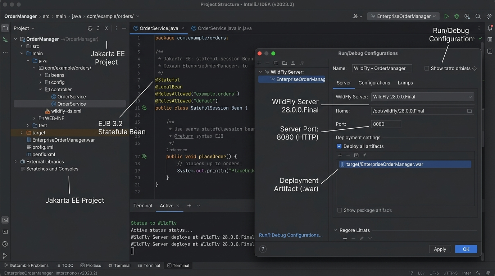

# Session 5 — Class Task (TIY - Try It Yourself)
## Facelets: Student Frontend Page

**Course:** Enterprise Application Development in Jakarta EE
**TL Session:** TL1 (Session 5)
**Duration:** 45 minutes

---

## 🎯 Task Objective

In this task, you will fulfill the textbook's "Try It Yourself" requirement:
*"Write a Jakarta Server Faces program to create a Student Front end page that includes Name, Last name, email id, and Future Goals."*

You will build a JSF Form (`.xhtml`) and connect it to a CDI Backing Bean (`@Named`).

---

## 🛠️ Step-by-Step Instructions

### Step 1: Create the Backing Bean

The backing bean is a standard Java class that acts as the data model for our Facelets page. It requires getters and setters so JSF can read and write the form data.

1. In your project, create a package called `com.school.web`.
2. Create a class named `StudentBean.java`.
3. Annotate it so that JSF can discover it.

```java
package com.school.web;

import jakarta.enterprise.context.RequestScoped;
import jakarta.inject.Named;

@Named("studentBean")
@RequestScoped
public class StudentBean {

    private String firstName;
    private String lastName;
    private String email;
    private String futureGoals;
    
    // This variable will hold a message after the form is submitted
    private String submissionMessage;

    // Action method called when the user clicks 'Submit'
    public void registerStudent() {
        this.submissionMessage = "Successfully registered: " + firstName + " " + lastName + 
                                 ". Goal: " + futureGoals;
        System.out.println("Registered student in backend: " + email);
    }

    // --- GETTERS AND SETTERS ---
    // (You MUST generate these in IntelliJ using Alt+Insert -> Getter and Setter)
    public String getFirstName() { return firstName; }
    public void setFirstName(String firstName) { this.firstName = firstName; }

    public String getLastName() { return lastName; }
    public void setLastName(String lastName) { this.lastName = lastName; }

    public String getEmail() { return email; }
    public void setEmail(String email) { this.email = email; }

    public String getFutureGoals() { return futureGoals; }
    public void setFutureGoals(String futureGoals) { this.futureGoals = futureGoals; }

    public String getSubmissionMessage() { return submissionMessage; }
    public void setSubmissionMessage(String submissionMessage) { this.submissionMessage = submissionMessage; }
}
```

### Step 2: Create the Facelets Page (View)

Now, we will create the XHTML page that uses JSF components (`h:inputText`, `h:commandButton`) instead of standard HTML inputs. This allows the inputs to automatically bind to the server-side `StudentBean`.

1. In your `webapp` directory (where `WEB-INF` is located), create a new file named `student_registration.xhtml`.
2. Add the JSF namespaces to the `<html>` tag.
3. Build the form.

```xml
<!DOCTYPE html>
<html xmlns="http://www.w3.org/1999/xhtml"
      xmlns:h="jakarta.faces.html"
      xmlns:f="jakarta.faces.core">
<h:head>
    <title>Student Registration</title>
    <style>
        .form-group { margin-bottom: 15px; }
        .success { color: green; font-weight: bold; }
    </style>
</h:head>
<h:body>
    <h2>Student Registration Portal</h2>
    
    <!-- h:form handles the POST request back to the server -->
    <h:form>
        <div class="form-group">
            <h:outputLabel value="First Name: " />
            <h:inputText value="#{studentBean.firstName}" required="true" />
        </div>
        
        <div class="form-group">
            <h:outputLabel value="Last Name: " />
            <h:inputText value="#{studentBean.lastName}" required="true" />
        </div>
        
        <div class="form-group">
            <h:outputLabel value="Email ID: " />
            <h:inputText value="#{studentBean.email}" required="true" />
        </div>
        
        <div class="form-group">
            <h:outputLabel value="Future Goals: " />
            <h:inputTextarea value="#{studentBean.futureGoals}" rows="4" cols="30" />
        </div>
        
        <!-- The action attribute binds to the Java method -->
        <h:commandButton value="Register Student" action="#{studentBean.registerStudent}" />
    </h:form>

    <!-- This will only display if the submissionMessage is not empty -->
    <h:outputText class="success" value="#{studentBean.submissionMessage}" 
                  rendered="#{not empty studentBean.submissionMessage}" />

</h:body>
</html>
```

### Step 3: Deployment and Testing in IntelliJ IDEA



#### IntelliJ Navigation Flow:
1. **Configure Web Artifact:** In IntelliJ IDEA, verify `web.xml` maps `FacesServlet` to `*.xhtml` (under `src/main/webapp/WEB-INF/web.xml`).
2. **Open Run Configuration:** Select your **WildFly** configuration in the top right dropdown and ensure your `war` artifact is deployed.
3. **Run Server:** Click the green **Run** button (or press `Shift + F10`).
4. **Inspect Deployment Console:** In the bottom **Services / Terminal** tab, ensure WildFly starts and deploys the `.war` successfully without context errors.
5. **Visit in Browser:** Open:
   ```
   http://localhost:8080/YourAppName/student_registration.xhtml
   ```
6. **Test the Form:** Fill out the input fields (Name, Last Name, Email, Future Goals) and click **Register Student**.
7. **Observe UI State:** Notice how JSF automatically decodes the form parameters, invokes `registerStudent()`, and re-renders the component tree with your success message! 

---

## 👩‍🏫 Instructor Verification

When you have successfully registered a student and the success message appears on the screen, call your instructor over to verify your UI and Java code. Be prepared to explain how the Expression Language (`#{...}`) connects the XHTML to the Java class.
