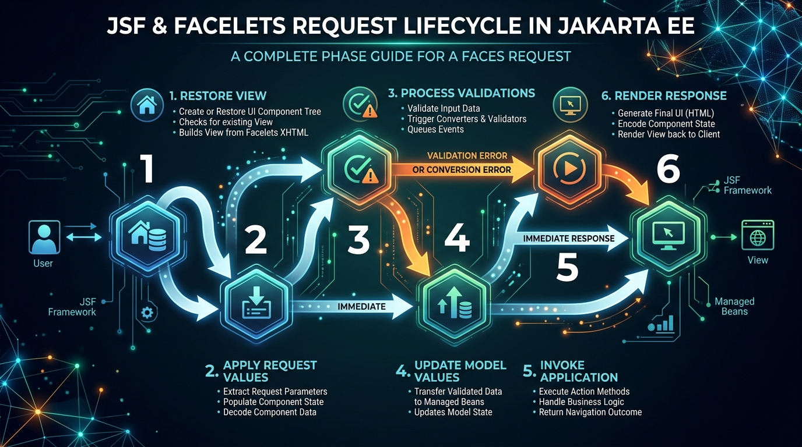

# Session 5 — Facelets in Jakarta Enterprise Beans
## Theory Guide

**Course:** Enterprise Application Development in Jakarta EE
**TL Session:** TL1 (Session 5)

---

## Learning Objectives

By the end of this session, you will be able to:
- ➢ Define Facelets and Jakarta Server Faces (JSF).
- ➢ Explain the request-response lifecycle of Facelets.
- ➢ Create a simple Facelet Application.
- ➢ Define and use composite components.
- ➢ Define and manage Web Resources.

---

## 5.1 Introduction to Facelets

**JavaServer Faces (JSF)**, known as **Jakarta Server Faces** in the Jakarta EE ecosystem, is a server-side component-centric user interface (UI) framework for web applications. 

One of its significant benefits is that it offers a clear division between behavior (Java code) and presentation (Web pages). The server maps HTTP requests to component-specific event handling. 

**Facelets** is the default view declaration language for JSF. It allows developers to build views using XHTML pages rather than traditional JSP (JavaServer Pages).

*Note: In Jakarta EE 9+ (Jakarta Faces 3.0+), the namespace is `jakarta.faces`. The Facelets tag library URI is `xmlns:ui="jakarta.faces.facelets"`.*

### Features of Facelets
- Rapid Web development and HTML5 support.
- Standard look and feel of UI.
- Exception handling is inbuilt.
- Built over JSF and uses bean annotations.
- Supports Internationalization.
- Templating promotes massive code reuse.
- Extremely fast view rendering with compile-time validation of Expression Language (EL).

### Common Facelets Library Tags

| Tag | Function |
| :--- | :--- |
| `ui:decorate` | Behaves as a composition tag but considers content outside the tag. |
| `ui:component` | Creates a component and adds it to the component tree. |
| `ui:insert` | Puts content into a template. |
| `ui:composition` | Defines a page composition. Ignores content outside of it. |
| `ui:param` | Passes parameters in a Web page or file. |
| `ui:include` | Includes or encapsulates content from another page. |
| `ui:define` | Defines contents that a template will insert into a page. |
| `ui:repeat` | Defines a loop (often used instead of JSTL's `c:forEach`). |

---

## 5.2 Lifecycle of Facelets



A JSF lifecycle starts when a client sends an HTTP request and ends when the server returns an HTML response. The lifecycle is broadly divided into two high-level phases: **Execute** and **Render**.

The **Execute** phase has several sub-phases. In total, there are 6 distinct phases in the JSF Request Processing Lifecycle:

1. **Restore View:** The container builds or restores the component tree in the `FacesContext`. If it is an initial request, an empty view is created and passed directly to Render Response. If it is a postback (e.g., clicking a submit button), the view state is restored.
2. **Apply Request Values:** Each component in the tree retrieves its current state and values from the request parameters (this is called "decoding").
3. **Process Validation:** All validators and converters attached to the components are run. If validation fails, an error is added to `FacesContext` and the lifecycle jumps immediately to Render Response.
4. **Update Model Values:** The validated local component values are saved directly into the server-side backing bean attributes.
5. **Invoke Application:** The application executes business logic (e.g., calling an EJB, saving to a database). The outcome string from this logic is passed to the navigation handler.
6. **Render Response:** The requested view is rendered as HTML back to the client browser, and the current state is saved for the next request.

---

## 5.3 Creating a Simple Facelet Application

To create a Facelets application, you need configuration files, an XHTML page, and a Backing Bean.

### 1. The Configuration (`web.xml` and `beans.xml`)
The `web.xml` registers the `FacesServlet`, which acts as the Front Controller for all JSF requests.
```xml
<!-- web.xml -->
<servlet>
    <servlet-name>Faces Servlet</servlet-name>
    <servlet-class>jakarta.faces.webapp.FacesServlet</servlet-class>
    <load-on-startup>1</load-on-startup>
</servlet>
<servlet-mapping>
    <servlet-name>Faces Servlet</servlet-name>
    <url-pattern>*.xhtml</url-pattern>
</servlet-mapping>
```
You also need an empty `beans.xml` in your `WEB-INF` folder to enable Contexts and Dependency Injection (CDI).

### 2. The Backing Bean
This Java class holds the data and logic for the view.
```java
package jsf.hello;

import java.io.Serializable;
import jakarta.enterprise.context.SessionScoped;
import jakarta.inject.Named;

@Named("helloWorld") // Makes this bean accessible in the XHTML page
@SessionScoped
public class HelloWorld implements Serializable {
    private String str = "Hello, we have created our first Jakarta Server Faces code";
    
    public String getStr() { return str; }
    public void setStr(String str) { this.str = str; }
}
```

### 3. The Facelet View (`helloWorld.xhtml`)
The user interface using Facelet tags and Expression Language (`#{...}`).
```xml
<!DOCTYPE html>
<html xmlns="http://www.w3.org/1999/xhtml"
      xmlns:h="jakarta.faces.html">
<h:head>
    <title>Hello</title>
</h:head>
<h:body>
    <p>Message from the server:</p>
    <!-- EL binds this to the getStr() method of HelloWorld bean -->
    <h:outputText value="#{helloWorld.str}"/>
</h:body>
</html>
```

---

## 5.4 Composite Components

Composite components allow developers to create custom UI components using a collection of standard tags. They promote code reuse and uniformity. For example, a custom "Login Box" or "Shipping Address Form" can be written once and reused across many pages.

### Common Tags for Composite Components
- `composite:interface`: Defines the contract (attributes) of the custom component.
- `composite:implementation`: Defines the actual UI layout of the component.
- `composite:attribute`: Declares an attribute that the user of the component must provide.
- `composite:insertChildren`: Allows the developer to insert child components into a specific location inside the parent composite.

---

## 5.5 Web Resources

Web resources are static files like CSS, Images, and JavaScript. Jakarta Server Faces has a standardized way of locating and rendering these resources.

By default, JSF looks for a `resources` directory in the root of the Web application.

### Using Resources in Facelets
- **CSS:** `<h:outputStylesheet library="css" name="style.css"/>` (Looks in `/resources/css/style.css`)
- **Images:** `<h:graphicImage value="#{resource['images:hero.gif']}"/>` (Looks in `/resources/images/hero.gif`)
- **JavaScript:** `<h:outputScript library="scripts" name="app.js"/>` (Looks in `/resources/scripts/app.js`)

---

## 📺 Recommended Video Resources
To reinforce the concepts covered in this session, consider searching for the following video tutorials on YouTube:

1. **Channel:** Java Brains  
   **Video Title:** *JSF and Facelets Tutorial*
2. **Channel:** Luv2code  
   **Video Title:** *JSF (JavaServer Faces) Tutorial for Beginners*
3. **Channel:** Programming Knowledge  
   **Video Title:** *JSF Web Application using Eclipse, Tomcat and Facelets*
