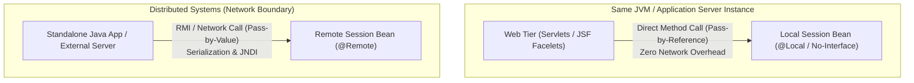
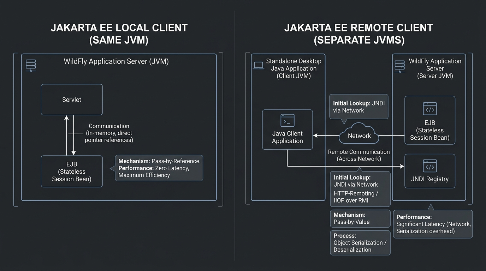
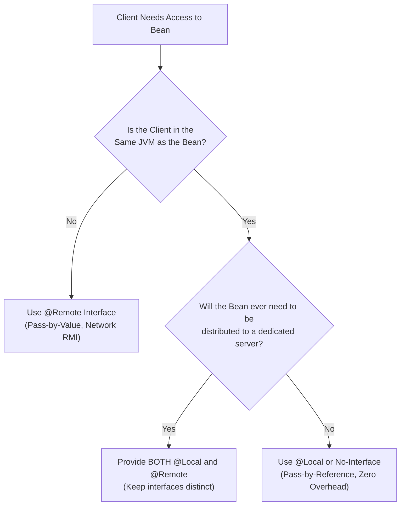

# Session 6: Jakarta Local and Remote Clients

Welcome to **Session 6: Jakarta Local and Remote Clients**. In enterprise architectures, business components (Enterprise JavaBeans) rarely operate in isolation. They are consumed by a wide range of clients—ranging from co-located web servlets within the exact same Java Virtual Machine (JVM) to independent desktop applications, microservices, and distributed servers across global networks.

This session explains the mechanics, trade-offs, and lifecycles of **Local Clients** and **Remote Clients** in Jakarta Enterprise Beans (EJB), and how to select the right client paradigm for enterprise performance and scalability.

---

## 🎯 Learning Objectives

By the end of this session, you will be able to:
1. **Define** Jakarta Local Clients and Remote Clients.
2. **Explain when to use** a Local Client vs. a Remote Client.
3. **Apply the decision criteria** for choosing between Local and Remote interfaces.
4. **Trace the client view** of a session object's lifecycle.
5. **Describe session object identity**, handle serialization, and how it differs from Entity identity.
6. **Configure and invoke** both `@Local` and `@Remote` beans using WildFly and JNDI / EJB Client API.

---

## 1. Overview of Jakarta Local and Remote Clients

Enterprise applications decouple business logic into server-side beans. The component or application that calls an enterprise bean is termed a **Client**.

Clients can interact with enterprise beans through two main communication models:





### Key Differences at a Glance
| Feature | Local Client | Remote Client |
| :--- | :--- | :--- |
| **Execution Environment** | Must execute in the **same JVM** as the enterprise bean | Can execute in a **different JVM**, on another machine, or standalone |
| **Parameter Passing** | **Pass-by-Reference** (Java reference pointers; memory sharing) | **Pass-by-Value** (Serialized over the network via RMI/IIOP or HTTP) |
| **Overhead & Speed** | Extremely fast; zero network marshaling | Slower due to network latency, marshaling, and unmarshaling |
| **Interface Requirement**| `@Local` interface OR **No-Interface View** | **Must** declare a `@Remote` business interface |
| **Location Transparency**| Lost (Client and bean must be co-located) | Preserved (Client does not care where the bean resides) |

---

## 2. Jakarta Local Clients

### 2.1 Characteristics
* **Same JVM:** The Local Client runs inside the exact same container/JVM runtime as the target bean.
* **Component Types:** Typically a Servlet, JSF Managed Bean/Backing Bean, REST endpoint, or another enterprise bean within the same `.ear` or `.war` archive.
* **Pass-by-Reference:** Arguments and return values are not serialized. Changes made to an object by the bean are immediately reflected in the client's copy.
* **No-Interface View:** If a bean does not implement any business interface, all of its public methods automatically form a local no-interface view.

### 2.2 Access Methods for Local Beans
A local bean can be exposed in three ways:
1. **No-Interface View:** Bean class without an interface:
   ```java
   @Stateless
   public class OrderService {
       public void processOrder() { ... }
   }
   ```
2. **Explicit `@Local` on Interface:**
   ```java
   @Local
   public interface CalculatorLocal {
       int add(int a, int b);
   }
   ```
3. **Explicit `@Local` on Bean Class:**
   ```java
   @Stateless
   @Local(CalculatorLocal.class)
   public class CalculatorBean implements CalculatorLocal { ... }
   ```

---

### 2.3 Local Client Example: Prime Number Generator

Below is an EJB that calculates prime numbers from 1 to 100 using a Local Interface.

#### Step 1: Local Interface
```java
package com.demo.local;

import jakarta.ejb.Local;

@Local
public interface PrimeCalculatorLocal {
    String getPrimesUpTo(int limit);
}
```

#### Step 2: Stateless Session Bean Implementation
```java
package com.demo.local;

import jakarta.ejb.Stateless;

@Stateless
public class PrimeCalculatorBean implements PrimeCalculatorLocal {

    @Override
    public String getPrimesUpTo(int limit) {
        StringBuilder primeNumbers = new StringBuilder();

        for (int i = 2; i <= limit; i++) {
            int counter = 0;
            for (int num = i; num >= 1; num--) {
                if (i % num == 0) {
                    counter++;
                }
            }
            if (counter == 2) {
                primeNumbers.append(i).append(" ");
            }
        }
        return primeNumbers.toString().trim();
    }
}
```

#### Step 3: Local Client (Co-located Servlet or CDI Client)
```java
package com.demo.local;

import jakarta.ejb.EJB;
import jakarta.servlet.annotation.WebServlet;
import jakarta.servlet.http.HttpServlet;
import jakarta.servlet.http.HttpServletRequest;
import jakarta.servlet.http.HttpServletResponse;
import java.io.IOException;

@WebServlet("/primes")
public class PrimeClientServlet extends HttpServlet {

    @EJB
    private PrimeCalculatorLocal primeCalculator;

    @Override
    protected void doGet(HttpServletRequest req, HttpServletResponse resp) throws IOException {
        String primes = primeCalculator.getPrimesUpTo(100);
        resp.setContentType("text/plain");
        resp.getWriter().println("Prime numbers from 1 to 100:\n" + primes);
    }
}
```

---

## 3. Jakarta Remote Clients

### 3.1 Characteristics
* **Distributed Access:** Remote clients run on physical machines or distinct JVM instances separate from the WildFly server.
* **Network Protocol:** Communication occurs via network protocols (e.g., JBoss Remoting / HTTP-Remoting over port `8080`).
* **Pass-by-Value:** All method arguments and return types **must implement `java.io.Serializable`**. The container marshals (serializes) parameters into byte streams across the network and unmarshals (deserializes) them on the other end.
* **No No-Interface View:** Remote beans **cannot** expose a no-interface view. A distinct `@Remote` business interface is mandatory.

---

### 3.2 Remote Client Example: String Reversal Service

#### Step 1: Remote Business Interface
```java
package com.demo.remote;

import jakarta.ejb.Remote;

@Remote
public interface StringReverseRemote {
    String reverseString(String input);
}
```

#### Step 2: Stateless Session Bean Implementation
```java
package com.demo.remote;

import jakarta.ejb.Stateless;

@Stateless
public class StringReverseBean implements StringReverseRemote {

    @Override
    public String reverseString(String input) {
        if (input == null) return null;
        return new StringBuilder(input).reverse().toString();
    }
}
```

#### Step 3: Standalone Remote Client Application (Console Client)
```java
package com.demo.remote.client;

import com.demo.remote.StringReverseRemote;
import javax.naming.Context;
import javax.naming.InitialContext;
import javax.naming.NamingException;
import java.util.Properties;
import java.util.Scanner;

public class RemoteClientMain {

    public static void main(String[] args) {
        try {
            // Configure JNDI properties for WildFly EJB Remoting
            Properties jndiProps = new Properties();
            jndiProps.put(Context.INITIAL_CONTEXT_FACTORY, "org.wildfly.naming.client.WildFlyInitialContextFactory");
            jndiProps.put(Context.PROVIDER_URL, "remote+http://localhost:8080");

            Context context = new InitialContext(jndiProps);

            // JNDI Lookup Format:
            // "ejb:<appName>/<moduleName>/<distinctName>/<beanName>!<interfaceFullyQualifiedName>"
            String jndiName = "ejb:/RemoteLab/StringReverseBean!com.demo.remote.StringReverseRemote";
            StringReverseRemote service = (StringReverseRemote) context.lookup(jndiName);

            Scanner scanner = new Scanner(System.in);
            System.out.print("Enter a string to reverse: ");
            String input = scanner.nextLine();

            // Invoking remote method across the network
            String result = service.reverseString(input);
            System.out.println("Reversed string from Remote EJB: " + result);

        } catch (NamingException e) {
            System.err.println("JNDI Lookup failed: " + e.getMessage());
            e.printStackTrace();
        }
    }
}
```

---

## 4. Choosing Between Local and Remote Clients

Architects and developers must evaluate several trade-offs when designing enterprise beans:



### Evaluation Criteria

1. **Coupling (Tight vs. Loose):**
   * **Tightly Coupled Beans:** Beans that collaborate closely (e.g., an `InvoiceBean` invoking a `TaxCalculatorBean` thousands of times per second) should always use **Local interfaces** to eliminate network and serialization bottlenecks.
   * **Loosely Coupled Services:** Beans accessed by external front-ends or other departments require **Remote interfaces**.

2. **Performance & Latency:**
   * Local method calls are simple pointer dereferences inside RAM (nanoseconds).
   * Remote calls require socket connection handling, thread synchronization, marshaling, payload transmission over Ethernet/Wi-Fi, unmarshaling, and dispatch (milliseconds).

3. **Data Passing Semantics:**
   * Local: Modifications to objects inside the bean affect the caller's instance.
   * Remote: The bean receives an isolated copy of the serialized object. Any modifications made by the bean are lost unless the object is explicitly returned back to the client.

4. **Exposing Both Interfaces:**
   * A single enterprise bean can implement **both** `@Local` and `@Remote` interfaces.
   * **Constraint:** A single interface cannot be annotated with both `@Local` and `@Remote`. You must create two separate interface declarations (e.g., `OrderServiceLocal` and `OrderServiceRemote`).

---

## 5. Client View of Session Object Lifecycle & Identity

### 5.1 Client View on Lifecycle
From the client's perspective:
1. **Creation:** When a client obtains a reference via `@EJB`, CDI `@Inject`, or JNDI lookup, the container provides a proxy.
2. **Method Execution:** The client invokes business methods through the proxy.
3. **Destruction:** If a session bean is removed, times out, or the server crashes, subsequent client calls to that reference throw a `java.rmi.NoSuchObjectException`.

### 5.2 Session Object Identity (Anonymity)
A key distinction between **Session Beans** and **Entity Beans (JPA Entities)** is how identity is handled:

| Aspect | Session Bean (Stateless/Stateful) | Entity Bean / JPA Entity |
| :--- | :--- | :--- |
| **Identity Visibility** | **Hidden / Anonymous** | **Exposed Primary Key** (`@Id`) |
| **Primary Key Methods** | Calling `getPrimaryKey()` throws `RemoteException` | Has a defined primary key type (e.g., `Long`, `UUID`) |
| **Finder Methods** | No finder methods allowed (cannot search for a session bean) | Container/JPA provides finders (`em.find()`, JPQL) |
| **Client Association** | Dedicated or pooled resource for business tasks | Represents persistent state in a relational database |

#### Session Object Handles
A client can persist a reference to a session bean across restarts or sessions by obtaining a **Handle**:
* A client calls `sessionBean.getHandle()` to get a serializable handle.
* The handle can be serialized to disk or sent over a message queue.
* When deserialized, calling `handle.getEJBObject()` restores the proxy connection to the bean (provided the bean instance has not timed out or been removed by the container).

---

## 6. Summary

* **Local Clients** share the same JVM and memory space with the enterprise bean, utilizing pass-by-reference semantics for maximum performance.
* **Remote Clients** interact with enterprise beans across network boundaries using RMI / HTTP-remoting and pass-by-value serialization.
* **No-Interface View** is exclusive to local clients; remote clients strictly require a `@Remote` business interface.
* **Performance Consideration:** Network latency and serialization overhead make remote calls orders of magnitude slower than local calls. Tightly coupled components should always communicate locally.
* **Identity:** Session beans are anonymous business components and do not expose primary keys; entity objects represent persistent records uniquely identified by primary keys.

---

## 7. Check Your Progress

Test your understanding with these questions from the curriculum:

#### Question 1
**Which Java-based remote technology allows two Java applications running in different JVMs to communicate with one another?**
* a) Burlap
* b) EJB
* c) RMI (Remote Method Invocation)
* d) All of these  
**Answer:** **c) RMI**  
*Rationale:* RMI is the foundational Java standard enabling inter-process communication between distinct Java Virtual Machines.

---

#### Question 2
**To express a service through RMI, you have to create a service interface that extends:**
* a) `java.rmi.Remote`
* b) `java.rmi.RemoteException`
* c) `EJBObject.getPrimaryKey()`
* d) `java.lang.Exception`  
**Answer:** **a) `java.rmi.Remote`**  
*Rationale:* All classic RMI service interfaces must extend the marker interface `java.rmi.Remote`.

---

#### Question 3
**To call methods on a remote service, which exception must be handled or declared in classic remote interfaces?**
* a) `java.rmi.Remote`
* b) `java.rmi.RemoteException`
* c) `EJBObject.getPrimaryKey()`
* d) `java.lang.Exception`  
**Answer:** **b) `java.rmi.RemoteException`**  
*Rationale:* Network unreliability requires remote methods to declare `java.rmi.RemoteException` to account for connectivity failures.

---

#### Question 4
**An Entity component represents persistent data stored in a database and is primarily managed as a:**
* a) Server-side component
* b) Client-side component
* c) Server and client side component
* d) None of these  
**Answer:** **a) Server-side component**  
*Rationale:* Entities represent database tables and reside securely on the server managed by the persistence context.

---

#### Question 5
**In WildFly, clients can interact with remote session beans using the WildFly EJB Client API or by using:**
* a) JNDI to lookup a proxy
* b) Server-side Proxy
* c) Client-Side Proxy
* d) Server and Client Side Proxy  
**Answer:** **a) JNDI to lookup a proxy**  
*Rationale:* JNDI (`InitialContext.lookup(...)`) returns a client proxy dynamically configured to route remote method calls to WildFly.

---

## 📺 Recommended Video Resources
To reinforce the concepts covered in this session, search for the following video tutorials on YouTube:

1. **Channel:** Java Brains  
   **Video Title:** *Java EE / Jakarta EE - EJB Remote vs Local Interfaces Explained*
2. **Channel:** Derek Banas  
   **Video Title:** *Java EE Tutorial - EJB Client and JNDI Lookup*
3. **Channel:** Telusko  
   **Video Title:** *EJB Remote Client with JNDI in WildFly / GlassFish*
4. **Channel:** Amigoscode  
   **Video Title:** *Distributed Java Applications and Remote Communication Concepts*
