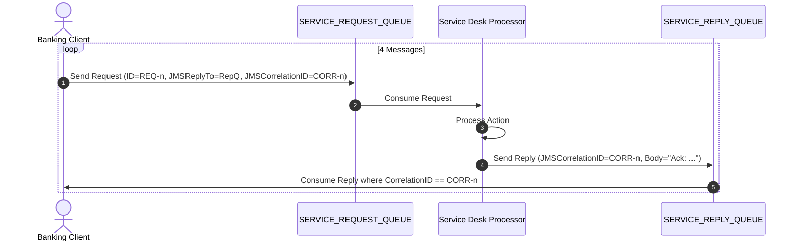

# Session 7 Assignment: Request-Reply Messaging Pattern with Jakarta JMS

## 📝 Assignment Overview

This assignment evaluates your understanding of asynchronous messaging architectures and your ability to implement a two-way conversational pattern over message queues.

Based on the textbook **Try It Yourself** requirement:
> *"Write a JMS code to send at least four messages to a consumer and four response messages from consumer using Queue."*

You will implement an **Enterprise Service Desk Dispatcher** using the **Request-Reply Pattern** via Jakarta Messaging (JMS).

---

## 🏢 Business Scenario

In a distributed banking architecture, account-servicing operations (e.g., balance check, account freeze, pin reset, fee waiver) are dispatched asynchronously to a backend processing engine. Because messaging is inherently decoupled, the client must associate each asynchronous response with its original request.

You must build:
1. A **Requestor Client (Producer & Reply Consumer)** that sends 4 separate requests to a `SERVICE_REQUEST_QUEUE`.
2. A **Service Processor (Consumer & Reply Producer)** that receives requests, executes business logic, and posts 4 matching reply messages back to a `SERVICE_REPLY_QUEUE`.
3. Communication linking must strictly use the standard JMS headers:
   * **`JMSReplyTo`**: Directs the processor to the destination reply queue.
   * **`JMSCorrelationID`**: Uniquely ties each reply back to its specific request.



---

## 📋 Specific Requirements

### 1. The 4 Mandatory Test Messages
Your client must send at least the following four distinct transaction/service messages:
1. **Message 1:** `RequestID: REQ-101 | Action: CHECK_BALANCE | Account: ACC-9871`
2. **Message 2:** `RequestID: REQ-102 | Action: LOCK_CARD | CardNumber: ****-****-****-4321`
3. **Message 3:** `RequestID: REQ-103 | Action: RESET_PIN | UserId: USR-5542`
4. **Message 4:** `RequestID: REQ-104 | Action: REQUEST_STATEMENT | Month: AUGUST_2026`

### 2. Message Exchange Specifications
* **Request Header:** Must set `message.setJMSReplyTo(replyQueue)` and `message.setJMSCorrelationID(uniqueId)`.
* **Processor Response:** The processor extracts `message.getJMSReplyTo()` and `message.getJMSCorrelationID()`, sets the reply's `JMSCorrelationID` equal to the request's correlation ID, and sends the response back to the reply queue.
* **Correlated Consumption:** The client must consume all 4 responses and verify that the correlation IDs match the dispatched requests.

---

## 📂 Expected Directory Structure

```
Session_07_Assignment/
├── pom.xml
└── src/main/java/com/assignment/jms/
    ├── broker/
    │   └── LocalBroker.java             (Starts embedded broker)
    ├── model/
    │   └── BankingServiceRequest.java   (Optional helper/DTO)
    ├── processor/
    │   └── ServiceDeskProcessor.java    (Processes requests & sends replies)
    ├── client/
    │   └── RequestorClientApp.java      (Sends 4 requests & consumes 4 replies)
    └── MainApp.java                     (Execution runner)
```

---

## 💡 Code Template & Guidance

### Processor Core Logic (`ServiceDeskProcessor.java`):
```java
public void onMessage(Message incomingMessage) {
    try {
        if (incomingMessage instanceof TextMessage) {
            TextMessage textMsg = (TextMessage) incomingMessage;
            String requestPayload = textMsg.getText();
            String correlationId = textMsg.getJMSCorrelationID();
            Destination replyDestination = textMsg.getJMSReplyTo();

            System.out.println("[PROCESSOR] Handling: " + requestPayload + " (CorrID: " + correlationId + ")");

            // Formulate response
            String responseText = "CONFIRMED: Processed action for [" + requestPayload + "] at " + System.currentTimeMillis();

            // Send reply to the designated destination
            TextMessage responseMessage = session.createTextMessage(responseText);
            responseMessage.setJMSCorrelationID(correlationId);

            MessageProducer replyProducer = session.createProducer(replyDestination);
            replyProducer.send(responseMessage);
            replyProducer.close();
        }
    } catch (JMSException e) {
        e.printStackTrace();
    }
}
```

---

## 🧪 Edge Cases & Testing

1. **Out-of-Order Reply Handling:**
   * In distributed enterprise queues, responses might arrive out of order if multiple worker threads process them. Your client should match responses by `JMSCorrelationID` rather than assuming strictly sequential FIFO order.
2. **Timeout Protection:**
   * When receiving replies, always use a timeout (e.g., `consumer.receive(5000)`) instead of indefinite blocking `consumer.receive()` to avoid hanging the client if the processor fails.
3. **Resource Closure:**
   * Ensure that `Session`, `Connection`, `MessageProducer`, and `MessageConsumer` objects are properly closed in `finally` blocks or via try-with-resources.

---

## 📊 Grading Rubric

| Criteria | Points | Description |
| :--- | :---: | :--- |
| **Broker & Infrastructure Setup** | **15 pts** | Working embedded or standalone JMS broker configuration without crashes. |
| **Producer Implementation** | **25 pts** | Dispatches at least 4 unique messages with valid payloads, `JMSReplyTo`, and `JMSCorrelationID`. |
| **Processor Implementation** | **25 pts** | Correctly extracts reply destination and correlation ID, processes each message, and dispatches a valid response. |
| **Correlated Response Consumption** | **20 pts** | Client successfully receives all 4 responses and matches each to its original correlation ID. |
| **Code Structure & Error Handling** | **15 pts** | Clean packaging, graceful exception handling, non-blocking timeouts, and clean shutdown. |
| **Total** | **100 pts** | |

---

## 📤 Submission Instructions

1. Zip your project directory into an archive named:
   `LastName_FirstName_Session07_Assignment.zip`
2. Include a **`README.md`** with terminal instructions to run the application.
3. Include console screenshots or logs showing:
   * The 4 messages being sent with their Correlation IDs.
   * The Processor receiving and handling each message.
   * The 4 matching reply confirmations received back by the client.
4. Submit the archive to your course portal before the session deadline.
