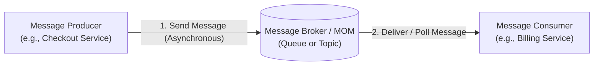
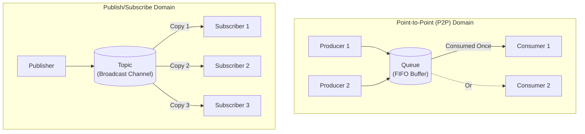
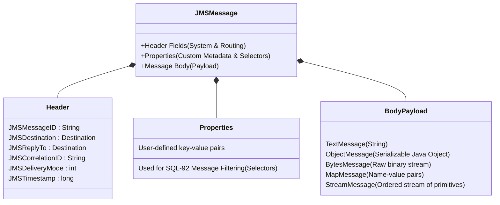
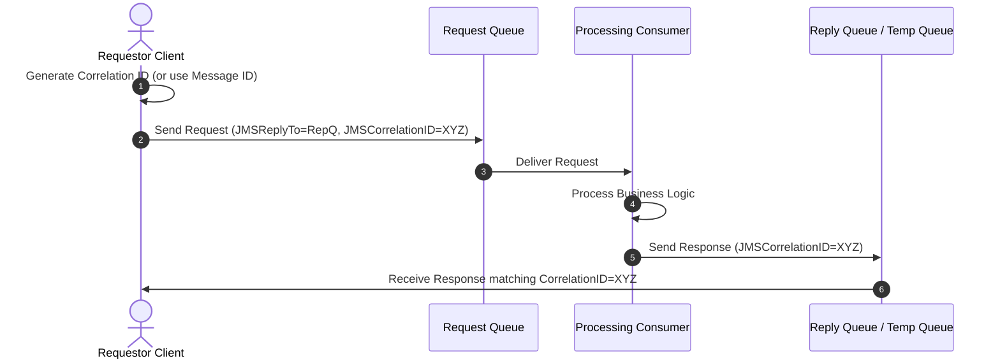

# Session 7: Jakarta Messaging Services (JMS)

Welcome to **Session 7: Jakarta Messaging Services (JMS)**. Modern distributed enterprise applications require loose coupling, high availability, and asynchronous processing. When an order is placed on an e-commerce platform, the user should not be forced to wait synchronously while inventory is adjusted, warehouse packing slips are printed, invoices are generated, and email receipts are dispatched. 

Jakarta Messaging (formerly Java Message Service - JMS) provides a standardized enterprise API for Message-Oriented Middleware (MOM), allowing systems to communicate reliably and asynchronously.

---

## 🎯 Learning Objectives

By the end of this session, you will be able to:
1. **Define** Jakarta Messaging and Message-Oriented Middleware (MOM).
2. **Compare** synchronous Remote Procedure Calls (RMI / RPC) with asynchronous messaging.
3. **Contrast** the two primary messaging domains: **Point-to-Point (Queue)** and **Publish/Subscribe (Topic)**.
4. **Explain** the roles of **Administered Objects**, **Connection Factories**, and **Destinations**.
5. **Differentiate** between the **Classic API (JMS 1.1)** and the **Simplified API (JMS 2.0 / Jakarta Messaging)** (`JMSContext`, `JMSProducer`, `JMSConsumer`).
6. **Structure** JMS Messages (Header, Properties, Body) and apply message acknowledgement modes.
7. **Implement Request-Reply communication** using `JMSCorrelationID` and `JMSReplyTo`.

---

## 1. Introduction to Jakarta Messaging & MOM

### 1.1 What is Message-Oriented Middleware (MOM)?
**Message-Oriented Middleware (MOM)** is software infrastructure that resides between distributed software components, enabling asynchronous data exchange. 
* A client that creates and transmits a message is called a **Message Producer (or Sender/Publisher)**.
* A client that receives and processes a message is called a **Message Consumer (or Receiver/Subscriber)**.
* The intermediary storage and routing system is called the **Message Broker (or Provider)**. Examples include **Apache ActiveMQ**, **WildFly Embedded Artemis**, and **RabbitMQ** (via JMS clients).



### 1.2 Limitations of Synchronous Calls (RPC / RMI) vs. MOM

| Criteria | Synchronous Calls (RMI / REST / RPC) | Asynchronous Messaging (MOM / JMS) |
| :--- | :--- | :--- |
| **Blocking Behavior** | **Blocking:** Caller thread blocks until the callee returns a response | **Non-blocking:** Producer sends message and immediately continues executing |
| **Coupling** | **Tightly coupled:** Caller must know the callee's network address and protocol | **Decoupled:** Senders and receivers interact only with the destination channel |
| **Temporal Dependency** | Both caller and callee must be online simultaneously | **Time-independent:** Consumer can be offline; broker buffers messages until online |
| **Reliability** | Throws immediate exceptions if target server crashes or restarts | Broker guarantees delivery via persistent storage (guaranteed delivery) |
| **Load Balancing** | Harder to scale; spikes directly overwhelm target servers | Queues act as buffers, smoothing out traffic spikes |

---

## 2. Jakarta Messaging Domains

Jakarta Messaging defines two distinct messaging communication patterns:



### 2.1 Point-to-Point (P2P) Domain (Queues)
* **Destination Object:** `jakarta.jms.Queue`
* **Rule:** A message is delivered to **exactly one consumer**. Multiple producers can send to the queue, and multiple consumers can listen, but each individual message is consumed only once (First-In, First-Out by default).
* **Communication Style:** Traditionally pull- or polling-based, though asynchronous listeners (`MessageListener`) can be configured.
* **Retention:** The message remains stored on the broker until acknowledged by a consumer or until it expires.
* **Typical Use Case:** Financial transaction processing, order fulfillment, batch job processing.

### 2.2 Publish/Subscribe (Pub/Sub) Domain (Topics)
* **Destination Object:** `jakarta.jms.Topic`
* **Rule:** One-to-many broadcast. Every subscribed consumer receives its own separate copy of the published message.
* **Communication Style:** Push-based multicasting.
* **Subscription Types:**
  1. **Non-Durable Subscription (Default):** Messages are delivered only to active subscribers connected at the moment of publication. If a subscriber goes offline, messages sent during downtime are lost.
  2. **Durable Subscription:** The broker maintains messages for offline subscribers until they reconnect and acknowledge receipt.
  3. **Shared Subscription:** Introduced in JMS 2.0; multiple consumers share a single subscription, distributing the load across instances.
* **Typical Use Case:** Stock price updates, sports tickers, live notifications, news broadcast feeds.

---

## 3. Jakarta Messaging Architecture & Administered Objects

### 3.1 Architectural Components
A Jakarta Messaging system comprises:
1. **Jakarta Messaging Provider:** The messaging broker and client libraries implementing the JMS specification (e.g., Apache ActiveMQ, WildFly Artemis).
2. **Jakarta Messaging Clients:** Java programs that create, send, receive, and inspect messages.
3. **Messages:** The structured data packets exchanged between clients.
4. **Administered Objects:** Pre-configured JMS configuration objects created by server administrators and accessed by clients via JNDI:
   * **`ConnectionFactory`:** Encapsulates connection configuration parameters to the broker.
   * **`Destination` (`Queue` or `Topic`):** The logical target address where messages are delivered.

---

## 4. Classic API vs. Simplified API

Over time, JMS evolved to reduce boilerplate code while preserving core capabilities:

| API Version | Era | Primary Classes & Flow |
| :--- | :--- | :--- |
| **Classic API** | JMS 1.1 / Jakarta EE 8 | `ConnectionFactory` ➔ `Connection` ➔ `Session` ➔ `MessageProducer` / `MessageConsumer` |
| **Simplified API** | JMS 2.0 / Jakarta EE 9+ | `ConnectionFactory` ➔ **`JMSContext`** ➔ **`JMSProducer`** / **`JMSConsumer`** |

### 4.1 Comparison of Setup Code

#### The Classic Approach (JMS 1.1):
```java
// Requires explicit Connection and Session management
ConnectionFactory factory = (ConnectionFactory) context.lookup("java:/ConnectionFactory");
Connection connection = factory.createConnection();
connection.start();

Session session = connection.createSession(false, Session.AUTO_ACKNOWLEDGE);
Queue queue = (Queue) context.lookup("java:/jms/queue/OrderQueue");

MessageProducer producer = session.createProducer(queue);
TextMessage message = session.createTextMessage("Order #1001");
producer.send(message);

// Must manually close session and connection
session.close();
connection.close();
```

#### The Simplified Approach (JMS 2.0 / Jakarta Messaging):
```java
// JMSContext implements AutoCloseable and manages connection/session automatically
ConnectionFactory factory = (ConnectionFactory) context.lookup("java:/ConnectionFactory");
Queue queue = (Queue) context.lookup("java:/jms/queue/OrderQueue");

try (JMSContext jmsContext = factory.createContext(JMSContext.AUTO_ACKNOWLEDGE)) {
    // Fluent, simplified API
    jmsContext.createProducer().send(queue, "Order #1001");
}
```

---

## 5. JMS Message Structure & Message Types

Every JMS message contains three distinct sections:



### 5.1 Acknowledgement Modes
When creating a session or `JMSContext`, you select how message consumption is confirmed back to the broker:
1. **`AUTO_ACKNOWLEDGE` (Default):** The session automatically acknowledges message receipt as soon as the client receives it or after the listener completes.
2. **`CLIENT_ACKNOWLEDGE`:** The client must explicitly invoke `message.acknowledge()`. All messages consumed up to that point within the session are acknowledged.
3. **`DUPS_OK_ACKNOWLEDGE`:** Lazy acknowledgement. Reduces network overhead by acknowledging in batches, though duplicate messages may be redelivered if the server crashes.

---

## 6. Request-Reply Pattern with Correlation ID

Because messaging is asynchronous, how does a sender know which response corresponds to which original request?
JMS solves this using two header fields:
1. **`JMSReplyTo`:** Destination (often a temporary queue) where the consumer should send the reply.
2. **`JMSCorrelationID`:** A unique identifier linking the reply back to the original request message ID.



### Requestor Implementation:
```java
TextMessage request = session.createTextMessage("Compute Tax");
Destination replyQueue = session.createTemporaryQueue();

request.setJMSReplyTo(replyQueue);
request.setJMSCorrelationID("REQ-9982");

producer.send(requestQueue, request);

// Listen or wait on the reply queue
MessageConsumer replyConsumer = session.createConsumer(replyQueue);
TextMessage reply = (TextMessage) replyConsumer.receive(5000);
System.out.println("Received Reply: " + reply.getText());
```

---

## 7. Summary

* **Message-Oriented Middleware (MOM)** unburdens enterprise applications by decoupling message producers from message consumers and replacing synchronous blocking calls with asynchronous message exchange.
* **Point-to-Point (Queue):** One-to-one delivery; message is consumed once by exactly one consumer.
* **Publish/Subscribe (Topic):** One-to-many broadcast; all active (or durable) subscribers receive their own copy.
* **Administered Objects:** `ConnectionFactory` and `Destination` (Queue/Topic) are provisioned on the application server and located using JNDI.
* **Simplified API (JMS 2.0+):** Utilizes `JMSContext` to combine connections and sessions into a single resource-managed structure.
* **Request-Reply Coordination:** Supported using `JMSReplyTo` headers and correlated via `JMSCorrelationID`.

---

## 8. Check Your Progress

Test your knowledge with these review questions from the course curriculum:

#### Question 1
**Which of the following destination objects is used when an enterprise application utilizes the Point-to-Point messaging model?**
* a) `Topic`
* b) `JMSContext`
* c) `Queue`
* d) Any of these  
**Answer:** **c) `Queue`**  
*Rationale:* Point-to-Point communication delivers each message to a single consumer through a `Queue`. Topics are used for Publish/Subscribe.

---

#### Question 2
**Which of the following does the `JMSContext` encapsulate in the Simplified JMS API?**
* a) `Connection`
* b) `Session`
* c) Both a and b
* d) `ConnectionFactory`  
**Answer:** **c) Both a and b**  
*Rationale:* `JMSContext` combines the active connection to the messaging provider and the single-threaded session into one unified, `AutoCloseable` context.

---

#### Question 3
**Which of the following are Administered Objects in Jakarta Messaging?**
* a) `Connection`
* b) `Session`
* c) `Destination` (Queues & Topics)
* d) None of these  
**Answer:** **c) `Destination`**  
*Rationale:* Administered objects are objects created and configured administratively on the server (namely `ConnectionFactory` and `Destination`). `Connection` and `Session` are runtime objects created programmatically by clients.

---

#### Question 4
**Which of the following statements is true regarding JMS Resources?**
* a) JMS resources are created by the application during runtime
* b) Queue and Topic objects are not JMS resources
* c) `ConnectionFactory` objects are JMS resources
* d) All of these  
**Answer:** **c) `ConnectionFactory` objects are JMS resources**  
*Rationale:* Connection factories and destinations are server-managed JMS resources configured on servers like WildFly or ActiveMQ.

---

#### Question 5
**Which of these is NOT an interface provided by the Jakarta Messaging (JMS) API?**
* a) `MessageConsumer`
* b) `ConnectionFactory`
* c) `MessageProducer`
* d) `Source`  
**Answer:** **d) `Source`**  
*Rationale:* `MessageConsumer`, `ConnectionFactory`, and `MessageProducer` are standard JMS interfaces. `Source` is not part of the JMS specification.

---

## 📺 Recommended Video Resources
To reinforce the concepts covered in this session, search for the following video tutorials on YouTube:

1. **Channel:** Java Brains  
   **Video Title:** *JMS Tutorial - Introduction to Messaging and Message Brokers*
2. **Channel:** Derek Banas  
   **Video Title:** *ActiveMQ and JMS Tutorial*
3. **Channel:** Telusko  
   **Video Title:** *JMS (Java Message Service) Tutorial for Beginners*
4. **Channel:** Defog Tech  
   **Video Title:** *JMS 2.0 Simplified API vs Classic API Explained*
