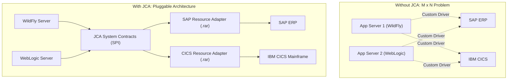
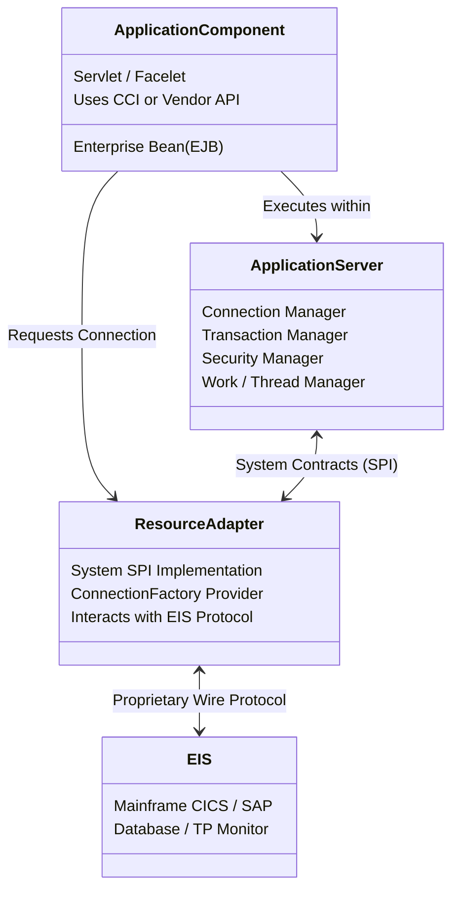
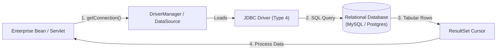

# Session 8: Understanding Jakarta Connectors Architecture (JCA) & JDBC

Welcome to **Session 8: Understanding Jakarta Connectors Architecture**. In an enterprise landscape, business applications do not exist in a vacuum. Organizations rely on an assortment of diverse, heterogeneous backends: Enterprise Resource Planning (ERP) software (such as SAP), mainframe transaction processors (such as IBM CICS/IMS), messaging brokers, non-relational datastores, and legacy systems written in COBOL, C++, or RPG.

Integrating each application server directly with each Enterprise Information System (EIS) via custom proprietary code creates a fragile, expensive $M \times N$ integration nightmare. 

The **Jakarta Connectors Architecture (JCA)** solves this challenge by standardizing how application servers connect to any EIS using a pluggable **Resource Adapter (RAR)**. Concurrently, for relational databases, the **Java Database Connectivity (JDBC)** API provides a standardized mechanism for querying and persisting enterprise data.

---

## 🎯 Learning Objectives

By the end of this session, you will be able to:
1. **Define** the Jakarta Connectors Architecture (JCA) and Enterprise Information Systems (EIS).
2. **Explain the $M \times N$ integration problem** and how Resource Adapters solve it.
3. **Detail the System-Level Contracts** defined by JCA (Connection Management, Transaction Inflow, Security).
4. **Contrast Outbound, Inbound, and Bidirectional** EIS communication.
5. **Differentiate** between the Common Client Interface (CCI), Service Provider Interface (SPI), and JDBC.
6. **Master JDBC operations**: Drivers, Connections, Statement types (`Statement`, `PreparedStatement`, `CallableStatement`), `ResultSet` handling, and the mandatory resource cleanup sequence.

---

## 1. The Enterprise Integration Problem & JCA Overview

### 1.1 What is an Enterprise Information System (EIS)?
An **Enterprise Information System (EIS)** is any enterprise-level software infrastructure that manages an organization's core business data and transactions:
* **ERP Systems:** SAP, Oracle E-Business Suite, Microsoft Dynamics.
* **Mainframe Transaction Processors:** IBM CICS, IMS, TUXEDO.
* **Database Management Systems:** Relational (MySQL, PostgreSQL, Oracle, SQL Server) and NoSQL stores.
* **Legacy Systems:** Proprietary systems developed on AS/400 or mainframe platforms.

### 1.2 The $M \times N$ Integration Problem vs. JCA Solution

Before JCA, if $M$ different application servers needed to talk to $N$ different EIS systems, developers had to write $M \times N$ custom, brittle point-to-point connectors:



With JCA, an EIS vendor builds **one standard Resource Adapter** (packaged as a `.rar` file). Any certified Jakarta EE application server (WildFly, GlassFish, Open Liberty) can load that adapter and immediately gain secure, transactional, pooled connectivity.

---

## 2. Jakarta Connectors Architecture (JCA) Components

A JCA architecture is divided into three functional layers:



### 2.1 The Core System-Level Contracts (SPI)
The application server and resource adapter collaborate via standard Java Service Provider Interfaces (SPI):

1. **Connection Management Contract:**
   * Allows the application server to pool connections to the EIS transparently, shielding application components from the complexity of opening and closing physical network sockets.
2. **Transaction Management Contract:**
   * Integrates the EIS with the application server’s Transaction Manager (JTA). An enterprise bean can coordinate a transaction spanning a PostgreSQL database and an external SAP ERP system atomically (2-Phase Commit / XA).
3. **Security Management Contract:**
   * Manages authentication, credential mapping, and secure propagation of caller identities from the web tier down to the mainframe/EIS.
4. **Work Management Contract:**
   * Allows the resource adapter to request worker threads from the application server's managed thread pool rather than spawning unmanaged OS threads.

---

## 3. Communication Models: Outbound vs. Inbound

| Model | Direction | Description | Initiator |
| :--- | :--- | :--- | :--- |
| **Outbound Communication** | Application ➔ EIS | The enterprise bean invokes a service or updates data inside the EIS. The resource adapter runs in the thread of the caller as a passive library. | **Application Component** |
| **Inbound Communication** | EIS ➔ Application | An event occurs inside the EIS (e.g., inventory drops below minimum), and the EIS calls an enterprise bean (MDB) to take action. | **EIS System** |
| **Bidirectional** | Both Directions | Supports full request-response synchronization between application and EIS in both directions. | **Both** |

---

## 4. Common Client Interface (CCI) vs. JDBC

While relational databases use SQL via the **JDBC API**, non-relational EIS systems do not have SQL tables. 
To address this, JCA defines the **Common Client Interface (CCI)**:
* **Common Client Interface (CCI):** Provides a generic client API for enterprise development tools to interact with any EIS using Record and Interaction abstractions (`Interaction.execute(InteractionSpec, Record)`).
* **JDBC API:** Specifically tailored for relational databases, executing SQL statements (`SELECT`, `INSERT`, `UPDATE`, `DELETE`) and processing tabular `ResultSet` data.

---

## 5. JDBC in Action: Core Architecture & Workflow

Enterprise applications persist their state in relational database management systems (RDBMS). JDBC is the foundational Java SE/EE API providing database connectivity.



### 5.1 The 6 Fundamental Steps in JDBC

1. **Load the Driver:**
   * Modern JDBC 4.0+ automatically discovers drivers on the classpath via the Java ServiceLoader (`META-INF/services/java.sql.Driver`).
   * Legacy approach: `Class.forName("com.mysql.cj.jdbc.Driver")`.
2. **Establish the Connection:**
   * `Connection conn = DriverManager.getConnection(url, user, password);`
   * In enterprise environments, prefer JNDI DataSources: `DataSource ds = (DataSource) ctx.lookup("java:comp/env/jdbc/MyDB");`
3. **Create Statements:**
   * `Statement`: Used for simple static SQL queries without parameters (susceptible to SQL Injection if concatenated!).
   * `PreparedStatement`: Pre-compiled SQL with `?` parameter placeholders. **Always preferred** for security, efficiency, and performance.
   * `CallableStatement`: Used to execute database Stored Procedures and Functions (`{call calculate_bonus(?, ?)}`).
4. **Execute the Query:**
   * `executeQuery()`: Used for `SELECT` queries; returns a `ResultSet`.
   * `executeUpdate()`: Used for `INSERT`, `UPDATE`, `DELETE`, and DDL statements; returns an `int` indicating the number of rows affected.
   * `execute()`: Used for generic statements that may return multiple results or boolean flags.
5. **Process the `ResultSet`:**
   * The cursor starts before the first row. Call `rs.next()` in a `while` loop to advance row by row and extract column values (`rs.getInt("id")`, `rs.getString("name")`).
6. **Close Resources in Strict Reverse Order:**
   * Always close in this order:
     $$\text{ResultSet} \longrightarrow \text{Statement} \longrightarrow \text{Connection}$$
   * **Best Practice:** Use Java 7+ **`try-with-resources`**, which automatically closes all JDBC resources in the reverse order of creation.

---

### 5.2 Comprehensive JDBC Code Example

Below is a robust enterprise example creating, querying, and updating a table using `PreparedStatement` and `try-with-resources`:

```java
package com.demo.jdbc;

import java.sql.*;

public class JdbcUserManager {

    private static final String DB_URL = "jdbc:mysql://localhost:3306/enterprise_db?useSSL=false&serverTimezone=UTC";
    private static final String DB_USER = "root";
    private static final String DB_PASS = "password";

    public static void main(String[] args) {
        JdbcUserManager manager = new JdbcUserManager();
        manager.initializeDatabase();
        manager.insertUser("Alice Smith", "alice@example.com");
        manager.listAllUsers();
    }

    public void initializeDatabase() {
        String createTableSql = "CREATE TABLE IF NOT EXISTS app_user ("
                + "id INT AUTO_INCREMENT PRIMARY KEY, "
                + "username VARCHAR(64) NOT NULL, "
                + "email VARCHAR(100) NOT NULL, "
                + "created_at TIMESTAMP DEFAULT CURRENT_TIMESTAMP"
                + ")";

        try (Connection conn = DriverManager.getConnection(DB_URL, DB_USER, DB_PASS);
             Statement stmt = conn.createStatement()) {

            stmt.execute(createTableSql);
            System.out.println("[DB INIT] Table 'app_user' verified / created successfully.");

        } catch (SQLException e) {
            System.err.println("[DB ERROR] Initialization failed: " + e.getMessage());
        }
    }

    public void insertUser(String username, String email) {
        String insertSql = "INSERT INTO app_user (username, email) VALUES (?, ?)";

        // try-with-resources automatically closes Connection and PreparedStatement
        try (Connection conn = DriverManager.getConnection(DB_URL, DB_USER, DB_PASS);
             PreparedStatement pstmt = conn.prepareStatement(insertSql)) {

            pstmt.setString(1, username);
            pstmt.setString(2, email);

            int rowsInserted = pstmt.executeUpdate();
            System.out.println("[INSERT] Inserted " + rowsInserted + " user: " + username);

        } catch (SQLException e) {
            System.err.println("[INSERT ERROR] " + e.getMessage());
        }
    }

    public void listAllUsers() {
        String selectSql = "SELECT id, username, email, created_at FROM app_user ORDER BY id ASC";

        // Reverse closure order: ResultSet, PreparedStatement, Connection
        try (Connection conn = DriverManager.getConnection(DB_URL, DB_USER, DB_PASS);
             PreparedStatement pstmt = conn.prepareStatement(selectSql);
             ResultSet rs = pstmt.executeQuery()) {

            System.out.println("\n--- Current Users in Database ---");
            while (rs.next()) {
                int id = rs.getInt("id");
                String name = rs.getString("username");
                String email = rs.getString("email");
                Timestamp createdAt = rs.getTimestamp("created_at");

                System.out.printf("ID: %d | Name: %-15s | Email: %-20s | Created: %s%n",
                        id, name, email, createdAt);
            }

        } catch (SQLException e) {
            System.err.println("[QUERY ERROR] " + e.getMessage());
        }
    }
}
```

---

## 6. Summary

* **Jakarta Connectors Architecture (JCA)** establishes a standardized infrastructure for integrating heterogeneous Enterprise Information Systems (EIS) with application servers without vendor lock-in.
* **Resource Adapter (RAR):** A modular software driver connecting an application server to an EIS, implementing standard system contracts.
* **JCA System Contracts (SPI):** Include connection management (pooling), transaction management (XA/2PC coordination), and security context propagation.
* **Communication Styles:**
  * **Outbound:** Application initiates calls to the EIS.
  * **Inbound:** EIS sends asynchronous events to application beans.
  * **Bidirectional:** Communication operates in both directions.
* **JDBC Architecture:** Provides low-level, high-performance connectivity to relational databases using SQL.
* **Resource Management:** Database resources must be closed in reverse order of creation (`ResultSet` ➔ `Statement` ➔ `Connection`), ideally managed automatically via `try-with-resources`.

---

## 7. Check Your Progress

Test your understanding with these questions from the curriculum:

#### Question 1
**Jakarta EE containers serve as the interface between ____________ and __________:**
* a) JDBC and platform’s lower-level performance
* b) platform’s lower-level performance and `@Remote`
* c) Component and platform’s lower-level performance
* d) JDBC and component  
**Answer:** **c) Component and platform’s lower-level performance**  
*Rationale:* The container mediates between the developer's high-level business component (EJB, Servlet) and the low-level server services (pooling, security, transactions).

---

#### Question 2
**EIS vendors can offer a single standard resource adapter for their EIS across any application server with the help of which architecture?**
* a) JDBC architecture
* b) Jakarta Connector Architecture (JCA)
* c) Both JDBC and Jakarta Connector Architecture
* d) None of these  
**Answer:** **b) Jakarta Connector Architecture**  
*Rationale:* JCA provides the standard SPI specification enabling a single resource adapter (`.rar`) to deploy seamlessly into any certified Jakarta EE application server.

---

#### Question 3
**What component is responsible for loading and getting an active connection to the database?**
* a) Driver (`DriverManager` / `DataSource`)
* b) Connection
* c) Statement
* d) ResultSet  
**Answer:** **a) Driver**  
*Rationale:* The database driver translates Java calls into database network protocol and instantiates the `Connection` object via `DriverManager.getConnection()`.

---

#### Question 4
**What is the correct order to close database resources when not using automatic resource management?**
* a) `Connection`, `Statement`, and `ResultSet`
* b) `ResultSet`, `Statement`, and `Connection`
* c) `Statement`, `Connection`, and `ResultSet`
* d) `Statement`, `ResultSet`, and `Connection`  
**Answer:** **b) `ResultSet`, `Statement`, and `Connection`**  
*Rationale:* Resources must always be closed in the exact reverse order of their acquisition: the cursor first (`ResultSet`), then the statement (`Statement`), and finally the underlying database socket (`Connection`).

---

#### Question 5
**Which process initiates all communication between an application and an EIS where the application drives the interaction?**
* a) Outbound communication
* b) Inbound communication
* c) Outbound and Inbound communication
* d) None of these  
**Answer:** **a) Outbound communication**  
*Rationale:* Outbound communication occurs when the application component initiates requests to read or modify data in an external EIS.

---

## 📺 Recommended Video Resources
To reinforce the concepts covered in this session, search for the following video tutorials on YouTube:

1. **Channel:** Java Brains  
   **Video Title:** *JDBC Tutorial - Connecting Java to Database and Statement vs PreparedStatement*
2. **Channel:** Telusko  
   **Video Title:** *Java Database Connectivity (JDBC) Complete Course*
3. **Channel:** Derek Banas  
   **Video Title:** *Java JDBC Tutorial and SQL Queries*
4. **Channel:** Defog Tech  
   **Video Title:** *JCA (Java EE Connector Architecture) and Resource Adapters Explained*
