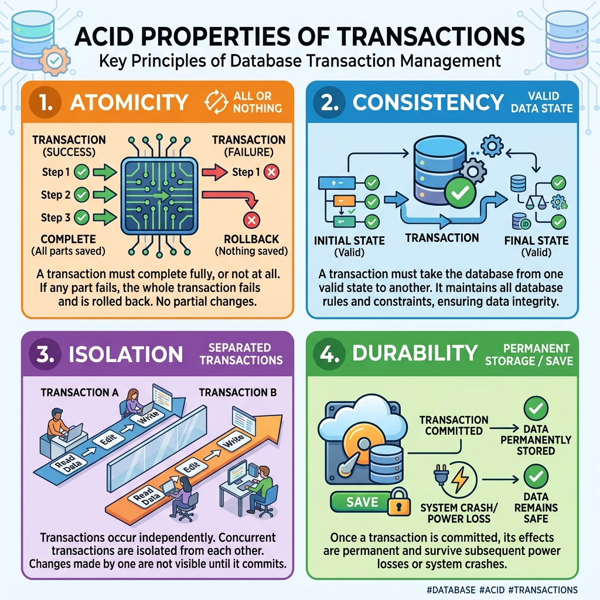
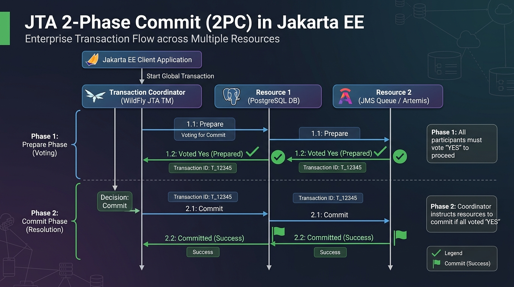
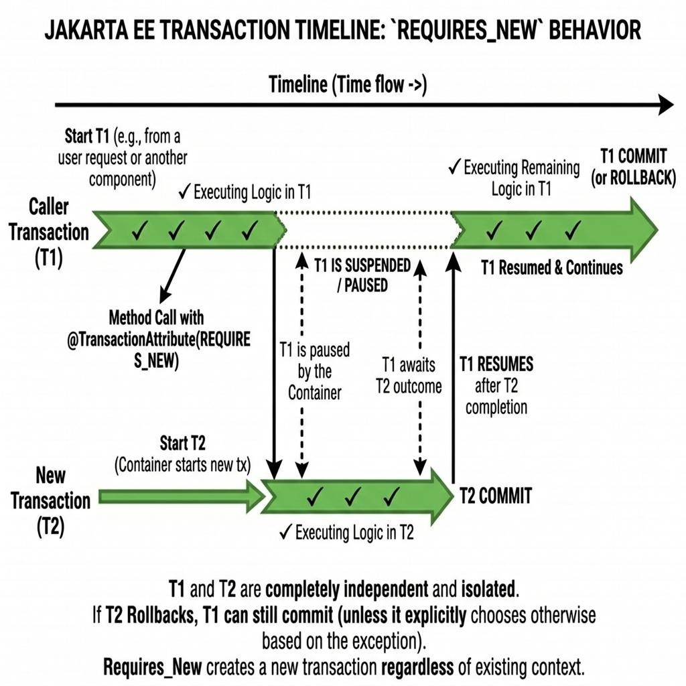
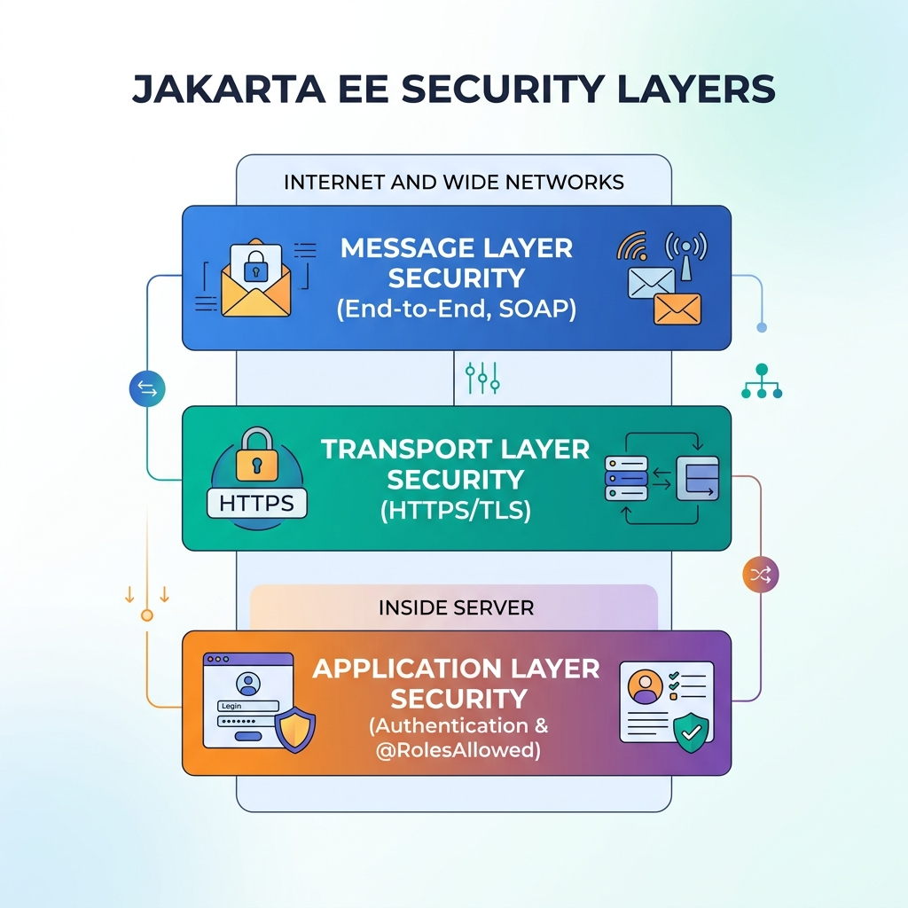

# Session 4 — Working with Jakarta Enterprise Beans
## Theory Guide

**Course:** Enterprise Application Development in Jakarta EE
**TL Session:** TL1 (Session 4)
**Prerequisites:** Sessions 1, 2, 3 — EJB types, JNDI, DataSources

---

## Learning Objectives

By the end of this session, you will be able to:
- ✅ Define a transaction and explain the ACID properties with real-world examples
- ✅ Distinguish between Programmatic and Declarative transaction demarcation
- ✅ Explain all six transaction attributes (Required, RequiresNew, Mandatory, NotSupported, Supports, Never)
- ✅ Describe Optimistic and Pessimistic locking and when to use each
- ✅ Explain `@ConcurrencyManagement` and `@Lock` in Singleton beans
- ✅ Describe event-driven programming with MDBs and CDI events
- ✅ Explain Application, Transport, and Message layer security in Jakarta EE

---

## 4.1 — Transaction Processing

### Real-World Analogy: The Bank Transfer

Imagine you walk into **GlobalBank** and ask a teller to transfer $1,000 from your savings account to your sister's account:

1. **Debit** $1,000 from YOUR account
2. **Credit** $1,000 to your SISTER'S account

These two operations must ALWAYS happen together. What if the computer:
- Completes Step 1 (money leaves your account)
- Then the power cuts out before Step 2 (money never arrives)

$1,000 has vanished from the banking system! This is why transactions exist.

A **transaction** is a group of operations that must ALL succeed or ALL fail together — **never a partial result**.

```
┌─────────────────────────────────────────────────────────────────┐
│                 BANK TRANSFER TRANSACTION                       │
├─────────────────────────────────────────────────────────────────┤
│  Operation 1: Debit  $1,000 from Account A ←──┐               │
│  Operation 2: Credit $1,000 to   Account B ←──┤               │
│                                               │               │
│  If BOTH succeed → COMMIT (make permanent)    │  Must ALL     │
│  If EITHER fails  → ROLLBACK (undo both)  ────┘  happen or    │
│                                                   none at all  │
└─────────────────────────────────────────────────────────────────┘
```

---

### The ACID Properties

Every valid transaction must satisfy four properties, known as **ACID**. The textbook says "Atomicity, Consistency, Integrity, Durability" — note that **I** more commonly stands for **Isolation** in the industry standard, which the textbook also explains.

#### A — Atomicity

> "All or nothing."

The transaction must execute **completely** or **not at all**. Even if only one step fails, all previous steps are rolled back (reversed).

**Real-world example**: Buying a flight ticket online involves charging your card AND reserving a seat. If the seat reservation fails after your card is charged, the charge must be automatically reversed. That is atomicity.

```java
// Conceptual pseudo-code showing atomicity
void transferFunds(Account from, Account to, double amount) {
    try {
        from.debit(amount);   // Step 1
        to.credit(amount);    // Step 2
        // Both succeeded → COMMIT
    } catch (Exception e) {
        // Either step failed → ROLLBACK everything
        // from.debit() is reversed automatically by the container
        throw new TransactionException("Transfer failed, rolled back");
    }
}
```

---

#### C — Consistency

> "The database must go from one valid state to another valid state."

Before the transaction, the database is consistent. After the transaction completes, the database must still be consistent — no rules or constraints should be broken.

**Real-world example**: A bank rule says "no account balance can go below -$500 (overdraft limit)." If a withdrawal would push the balance to -$600, the transaction must fail — because allowing it would put the database in an inconsistent state (a violated business rule).

---

#### I — Isolation

> "Concurrent transactions should not interfere with each other."

When multiple transactions run at the same time, each one should behave as if it is the **only** transaction running. Intermediate, uncommitted changes from one transaction should be invisible to other transactions.

**Real-world example**: Two bank tellers are both looking at your account simultaneously. Teller A is processing a $500 withdrawal. Teller B should not see the account balance as "$500 less" until Teller A's transaction is actually committed. This prevents Teller B from making decisions based on data that might still be rolled back.

```
WITHOUT Isolation (Bad!):
─────────────────────────────────────────────
Transaction A: Reads balance = $1,000 ✓
Transaction B: Reads balance = $1,000 ✓
Transaction A: Deducts $800 → balance = $200
Transaction A: COMMITS
Transaction B: Deducts $600 → balance = $400 ???
    → B read $1,000 before A committed,
      so it thinks there's enough money!
    → Account is now OVERDRAWN beyond limit

WITH Isolation (Correct!):
─────────────────────────────────────────────
Transaction A: Reads balance = $1,000 (acquires lock)
Transaction B: Tries to read → WAITS (A has the lock)
Transaction A: Deducts $800 → balance = $200, COMMITS
Transaction B: Now reads balance = $200 (correct!)
Transaction B: Tries to deduct $600 → FAILS (insufficient funds)
    → Isolation prevented the data integrity problem!
```

---

#### D — Durability

> "Committed changes survive forever — even crashes."

Once a transaction is committed, the changes are permanently saved. A power failure, system crash, or any other disaster after a commit must NOT cause data loss.

**Real-world example**: After a payment is committed in a bank system and the customer receives a receipt, the bank cannot later say "our server crashed and we lost the record." The durability property guarantees this can never happen — because committed data is written to disk, replicated, backed up, etc.

---

### ACID Summary Table



---

### JTA and JTS — The Transaction Management Infrastructure

In Jakarta EE, transactions are managed by two related technologies:

| Technology | Full Name | Role |
|---|---|---|
| **JTA** | Jakarta Transaction API | The API your application uses to interact with transactions. It is the interface between your code and the transaction manager. |
| **JTS** | Jakarta Transaction Service | The underlying specification that JTA is built on. Vendors implement JTS on their servers. |



```
YOUR EJB CODE
     ↓
   JTA API  (jakarta.transaction.UserTransaction)
     ↓
   JTS / OTS Implementation (built into WildFly)
     ↓
   Physical Databases, Message Queues, etc.
```

The JTS operates on **OTS (Object Transaction Service)**, which is part of the **CORBA** specification — a standard for distributed computing. You do not need to program at this level; the application server handles it.

---

### Transaction Demarcation: WHO Controls the Transaction Boundaries?

**Transaction demarcation** means deciding: *When does the transaction START? When does it END (commit or rollback)?*

There are two approaches:

```
┌───────────────────────────────────────┬───────────────────────────────────────┐
│     PROGRAMMATIC DEMARCATION          │     DECLARATIVE DEMARCATION           │
│     (Bean-Managed Transactions)       │     (Container-Managed Transactions)  │
├───────────────────────────────────────┼───────────────────────────────────────┤
│ Developer writes:                     │ Developer writes:                     │
│   userTransaction.begin();            │   @TransactionAttribute(REQUIRED)     │
│   // ... business logic ...           │   public void doSomething() { ... }   │
│   userTransaction.commit();           │                                       │
│   // or                               │ The CONTAINER automatically:          │
│   userTransaction.rollback();         │   - Begins the transaction            │
│                                       │   - Commits if method succeeds        │
├───────────────────────────────────────┤   - Rolls back if exception thrown    │
│ FULL control for the developer        ├───────────────────────────────────────┤
│ More complex, more error-prone        │ SIMPLE — annotations handle it all    │
│ Use when: very complex logic,         │ Less code, less chance of forgetting  │
│   multiple conditional commits        │   to commit or rollback               │
│                                       │ Use when: most standard use cases     │
└───────────────────────────────────────┴───────────────────────────────────────┘
```

---

### Container-Managed Transactions (CMT) — The Six Transaction Attributes

When using **Declarative Demarcation (CMT)**, you control how the container handles transactions using the `@TransactionAttribute` annotation. There are six possible values:

---

#### 1. `REQUIRED` — "Join or create"

> The method MUST run inside a transaction. If the caller already has one, use it. If not, create a new one.

```java
@Stateless
public class AccountBean implements AccountRemote {

    // REQUIRED is the DEFAULT if you don't specify an attribute
    @TransactionAttribute(TransactionAttributeType.REQUIRED)
    public void deposit(int accountId, double amount) {
        // This method WILL run inside a transaction
        // ● If Servlet calls this with no transaction → container creates one
        // ● If another EJB calls this from its transaction → this joins that transaction
        accountDAO.updateBalance(accountId, amount);
    }
}
```

**Timeline diagram:**
```
Scenario A (caller has no transaction):
Caller ──→ deposit() called
           ↑ Container creates Transaction T1
           deposit() executes within T1
           ↓ Container commits T1
           deposit() returns

Scenario B (caller has Transaction T1):
Caller (in T1) ──→ deposit() called
                   deposit() joins and runs within T1
                   deposit() returns
                   ↓ T1 commits or rolls back (caller decides)
```

---

#### 2. `REQUIRES_NEW` — "Always create a fresh one"

> The method ALWAYS runs in a NEW transaction, regardless of what the caller is doing. The caller's transaction is SUSPENDED.

```java
@TransactionAttribute(TransactionAttributeType.REQUIRES_NEW)
public void logAuditEvent(String event) {
    // This ALWAYS gets its own fresh transaction.
    // Even if the calling method's transaction fails and rolls back,
    // the audit log entry is ALREADY COMMITTED and won't be reversed.
    // This is critical for audit trails!
    auditDAO.insert(event);
}
```

**Use case**: Audit logging. You always want the audit log to be saved, even if the main business transaction fails. If you used `REQUIRED`, a rollback of the main transaction would also erase the audit log entry — which defeats the purpose of auditing.



---

#### 3. `MANDATORY` — "You MUST already have a transaction"

> A transaction MUST already exist when this method is called. If the caller has no transaction, an exception is thrown.

```java
@TransactionAttribute(TransactionAttributeType.MANDATORY)
public void performSecureUpdate(int id, String data) {
    // This method REFUSES to run without a pre-existing transaction.
    // Why? Because this is a sensitive operation that MUST be part of a 
    // larger, coordinated transaction managed by the caller.
    sensitiveDAO.update(id, data);
}
```

**Use case**: Internal helper methods that should only be called from within a business method that has already started a transaction. This prevents accidental calls from non-transactional code paths.

---

#### 4. `NOT_SUPPORTED` — "Suspend any transaction and run without one"

> This method CANNOT participate in a transaction. If a transaction exists, it is suspended for the duration of this method call.

```java
@TransactionAttribute(TransactionAttributeType.NOT_SUPPORTED)
public List<Product> getAllProducts() {
    // This is a simple read-only lookup. It does not need a transaction.
    // Running without a transaction can be faster (less overhead).
    // The caller's transaction (if any) is paused until this method returns.
    return productDAO.findAll();
}
```

**Use case**: Read-only reporting or lookup operations where transaction overhead is not needed and could actually slow things down.

---

#### 5. `SUPPORTS` — "Go with the flow"

> If the caller has a transaction, this method joins it. If not, this method runs without one.

```java
@TransactionAttribute(TransactionAttributeType.SUPPORTS)
public double getExchangeRate(String from, String to) {
    // If called from within a transaction → participates
    // If called directly from a client with no transaction → runs fine without one
    return currencyDAO.getRate(from, to);
}
```

**Use case**: Flexible read operations that can work correctly both within and outside of a transaction context.

---

#### 6. `NEVER` — "Do NOT call me from within a transaction"

> This method MUST NOT be called from within a transaction. If it is, an exception is thrown.

```java
@TransactionAttribute(TransactionAttributeType.NEVER)
public void runBatchReport() {
    // This method explicitly cannot be part of a transaction.
    // Why? It might run for a very long time (batch processing),
    // and holding a transaction open that long would block database resources.
    batchService.generateReport();
}
```

**Use case**: Long-running batch operations or processes that intentionally should NOT be transactional.

---

### Complete Comparison Table: The Six Transaction Attributes

```
┌────────────────┬──────────────────────────────────────────────────────────────────────────┐
│ Attribute      │ Behavior                                                                 │
│                │ [Caller HAS a Tx]          │ [Caller has NO Tx]                         │
├────────────────┼────────────────────────────┼─────────────────────────────────────────────┤
│ REQUIRED       │ Join caller's transaction  │ Create a new transaction                   │
│ REQUIRES_NEW   │ Suspend caller's, create   │ Create a new transaction                   │
│                │ a brand new one            │                                             │
│ MANDATORY      │ Join caller's transaction  │ 🚨 Throw TransactionRequiredException      │
│ NOT_SUPPORTED  │ Suspend caller's tx,       │ Run without any transaction                │
│                │ run without one            │                                             │
│ SUPPORTS       │ Join caller's transaction  │ Run without any transaction                │
│ NEVER          │ 🚨 Throw RemoteException   │ Run without any transaction                │
└────────────────┴────────────────────────────┴─────────────────────────────────────────────┘
```

---

### The `@TransactionAttribute` Annotation in Code

```java
import jakarta.ejb.Stateless;
import jakarta.ejb.TransactionAttribute;
import jakarta.ejb.TransactionAttributeType;

@Stateless
public class MyBean implements MyInterface {

    // ── Applied at METHOD level ──
    
    @TransactionAttribute(TransactionAttributeType.MANDATORY)
    public String codeBlack(String str) {
        // This specific method uses MANDATORY
        return str;
    }

    // No annotation on codeBrown → defaults to REQUIRED (the class-level default)
    public String codeBrown(String str) {
        return str;
    }
}
```

**Key rule**: If `@TransactionAttribute` is placed on the **class**, it applies to ALL methods in the class. If placed on a **specific method**, it overrides the class-level setting for just that method. If no annotation exists at all, the default is **REQUIRED**.

---

## 4.2 — Concurrency Control

### The Problem: Two Users, Same Data, At the Same Time

```
User A: Reads bank balance → $1,000
User B: Reads bank balance → $1,000  (at the same time as User A)
User A: Subtracts $800    → writes $200 to database
User B: Subtracts $600    → writes $400 to database  ← WRONG!
                                                         Should be $200!
Final balance: $400 (but it should be $200)
The bank just "created" $200 out of thin air!
```

This is the **lost update problem** — one of the concurrency issues that arise when multiple transactions access the same data simultaneously. Jakarta EE provides two main strategies to handle this.

---

### Strategy 1: Optimistic Locking — "Assume the best, check at the end"

**Philosophy**: Assume that most of the time, two transactions will NOT conflict. Do not lock the data — just check at commit time whether anyone else changed it since we read it.

**How it works**:

```
┌──────────────────────────────────────────────────────────────────┐
│                    OPTIMISTIC LOCKING FLOW                      │
├──────────────────────────────────────────────────────────────────┤
│                                                                  │
│  ① Read the entity (e.g., Account with balance=$1,000)          │
│     Note: version_number = 5                                    │
│                                                                  │
│  ② Do your business logic (subtract $800 → new balance = $200)  │
│                                                                  │
│  ③ At commit time, run an UPDATE like this:                      │
│     UPDATE accounts                                              │
│     SET balance = 200, version_number = 6                        │
│     WHERE account_id = 123 AND version_number = 5               │
│                              ↑                                   │
│                    "Has anyone else changed this                 │
│                    since I read it? (version still 5?)"         │
│                                                                  │
│  ④a If rows_updated = 1 → COMMIT SUCCESS! Nobody else changed it │
│  ④b If rows_updated = 0 → SOMEONE ELSE UPDATED IT FIRST!       │
│       → JPA throws OptimisticLockException → ROLLBACK           │
└──────────────────────────────────────────────────────────────────┘
```

**Implementing optimistic locking with `@Version`:**

```java
import jakarta.persistence.Entity;
import jakarta.persistence.Id;
import jakarta.persistence.Version;

@Entity
public class Account {

    @Id
    private int accountId;
    
    private double balance;
    
    /**
     * @Version tells JPA to use this field as the optimistic lock version counter.
     * JPA automatically:
     *   - Reads this value when loading the entity
     *   - Includes it in the WHERE clause of UPDATE statements
     *   - Increments it on each successful update
     * YOU never need to manually read or set this field.
     */
    @Version
    private int version;
    
    // Getters and setters...
    public int getAccountId() { return accountId; }
    public double getBalance() { return balance; }
    public void setBalance(double balance) { this.balance = balance; }
}
```

**What happens when a conflict occurs:**
```java
// Transaction 1 and Transaction 2 both read Account with version=5
// Transaction 1 commits first → version is now 6 in the database
// Transaction 2 tries to commit → JPA checks: WHERE version=5 → no rows match!
// JPA throws:
//   jakarta.persistence.OptimisticLockException
// The container rolls back Transaction 2.
// The application should catch this and retry the operation.
```

**When to use Optimistic Locking:**
- ✅ Read-heavy applications where conflicts are rare
- ✅ When maximum throughput and concurrency is important
- ✅ Most enterprise applications (this is the default and recommended approach)
- ❌ Do NOT use when conflicts are frequent or data integrity is absolutely critical

---

### Strategy 2: Pessimistic Locking — "Assume the worst, lock everything upfront"

**Philosophy**: Assume conflicts WILL happen. Lock the data before reading it so no one else can touch it while you work with it.

**Real-world analogy**: In an office, instead of working on a shared document and then discovering at the end that someone else already updated it, you first "check out" the document so no one else can edit it until you are done.

**The three pessimistic lock modes:**

```java
import jakarta.persistence.EntityManager;
import jakarta.persistence.LockModeType;
import jakarta.persistence.PersistenceContext;

@Stateless
public class TransactionBean {

    @PersistenceContext
    private EntityManager em;
    
    public void processLargeWithdrawal(int accountId, double amount) {
        
        // PESSIMISTIC_READ: Others can read but not write while we have this lock
        Account acct = em.find(Account.class, accountId, LockModeType.PESSIMISTIC_READ);
        
        // PESSIMISTIC_WRITE: Nobody can read or write while we have this lock
        // Use when you KNOW you will be updating the data
        Account acct2 = em.find(Account.class, accountId, LockModeType.PESSIMISTIC_WRITE);
        
        // PESSIMISTIC_FORCE_INCREMENT: Like PESSIMISTIC_WRITE but also increments
        // the @Version counter — even if you don't change any data field.
        // WARNING: Cannot be used on entities without @Version — throws PersistenceException!
        Account acct3 = em.find(Account.class, accountId, LockModeType.PESSIMISTIC_FORCE_INCREMENT);
    }
}
```

**Setting a lock timeout** (so you don't wait forever):

```java
import java.util.HashMap;
import java.util.Map;

// Set a 5-second timeout for acquiring the pessimistic lock
Map<String, Object> hints = new HashMap<>();
hints.put("jakarta.persistence.lock.timeout", 5000); // 5000 milliseconds

try {
    Account acct = em.find(Account.class, accountId, LockModeType.PESSIMISTIC_WRITE, hints);
    // If lock cannot be acquired within 5 seconds:
    // → LockTimeoutException is thrown
    
} catch (PessimisticLockException e) {
    // Could not acquire the lock at all (e.g., deadlock detected)
    // Handle: retry or report error to user
} catch (LockTimeoutException e) {
    // Waited 5 seconds but lock is still held by someone else
    // Handle: retry later or inform user to try again
}
```

---

### Optimistic vs. Pessimistic: A Comparison

```
┌──────────────────────────────┬────────────────────────────────────────────────────┐
│ Feature                      │ Optimistic            │ Pessimistic               │
├──────────────────────────────┼───────────────────────┼───────────────────────────┤
│ When does it lock?           │ Never (uses @Version) │ Immediately on read       │
│ What happens on conflict?    │ Exception at commit   │ Second thread must WAIT   │
│ Performance (low conflict)   │ ✅ Very fast           │ ❌ Slower (locking overhead)│
│ Performance (high conflict)  │ ❌ Many rollbacks      │ ✅ Better (waits, not fails)│
│ Risk of deadlock?            │ Very low              │ Higher risk               │
│ Best for                     │ Read-heavy, e-commerce│ Financial, critical data  │
│ JPA annotation needed        │ @Version on entity    │ LockModeType in find()    │
└──────────────────────────────┴───────────────────────┴───────────────────────────┘
```

---

### Concurrency in Singleton Beans — `@ConcurrencyManagement` and `@Lock`

Singleton beans present a unique challenge: there is only ONE instance, and multiple threads may try to call it simultaneously.

The `@ConcurrencyManagement` annotation controls how the container handles concurrent access:

#### Option A: Container-Managed Concurrency (Default)

```java
import jakarta.ejb.ConcurrencyManagement;
import jakarta.ejb.ConcurrencyManagementType;
import jakarta.ejb.Lock;
import jakarta.ejb.LockType;
import jakarta.ejb.Singleton;

@Singleton
@ConcurrencyManagement(ConcurrencyManagementType.CONTAINER)
public class ApplicationConfigBean {

    private String configValue = "default";
    
    /**
     * @Lock(WRITE): Only ONE thread can execute this method at a time.
     * Other threads that call this method MUST WAIT until the current thread finishes.
     * Use for: any method that MODIFIES the singleton's state.
     */
    @Lock(LockType.WRITE)
    public void updateConfig(String newValue) {
        this.configValue = newValue;
    }
    
    /**
     * @Lock(READ): MULTIPLE threads can execute this method simultaneously.
     * They are allowed to run in parallel as long as no thread holds a WRITE lock.
     * Use for: read-only methods that do NOT modify state.
     */
    @Lock(LockType.READ)
    public String getConfig() {
        return this.configValue;
    }
}
```

**Visual explanation:**
```
READ lock (getConfig):
Thread 1 ──→ getConfig() [READ lock]  ──────────────────→ done
Thread 2 ──→ getConfig() [READ lock]  ──────────────────→ done  ← Both can run at same time!
Thread 3 ──→ getConfig() [READ lock]  ──────────────────→ done

WRITE lock (updateConfig):
Thread 1 ──→ updateConfig() [WRITE lock] ──────────────────────→ done
Thread 2 ──→ updateConfig() [WRITE lock] ← BLOCKED, must wait →  starts → done
Thread 3 ──→ updateConfig() [WRITE lock] ← BLOCKED, must wait after T2 → starts → done
```

---

#### `@AccessTimeout` — Preventing Indefinite Waiting

```java
import jakarta.ejb.AccessTimeout;
import java.util.concurrent.TimeUnit;

@Singleton
@ConcurrencyManagement(ConcurrencyManagementType.CONTAINER)
public class ReportingBean {

    // @AccessTimeout(0): ZERO tolerance — if method is busy, throw exception IMMEDIATELY
    // Client gets ConcurrentAccessException right away
    @AccessTimeout(0)
    public void generateQuickReport() { /* ... */ }
    
    // @AccessTimeout(-1): Wait FOREVER — never timeout
    // DANGEROUS in production — could cause thread exhaustion
    @AccessTimeout(-1)
    public void generateLongReport() { /* ... */ }
    
    // @AccessTimeout(4000): Wait up to 4 seconds for the lock
    // If method is still busy after 4 seconds → ConcurrentAccessTimeoutException
    @AccessTimeout(value = 4000, unit = TimeUnit.MILLISECONDS)
    public void generateNormalReport() { /* ... */ }
}
```

---

#### Option B: Bean-Managed Concurrency

When you use `ConcurrencyManagementType.BEAN`, you take FULL responsibility for thread safety in the singleton. The container provides no help. You must use Java's built-in thread safety mechanisms:

```java
import jakarta.ejb.ConcurrencyManagement;
import jakarta.ejb.ConcurrencyManagementType;
import jakarta.ejb.Singleton;

@Singleton
@ConcurrencyManagement(ConcurrencyManagementType.BEAN)
public class ManuallyThreadSafeBean {

    // Thread-safe counter using AtomicInteger
    private java.util.concurrent.atomic.AtomicInteger counter = 
        new java.util.concurrent.atomic.AtomicInteger(0);
    
    // synchronized keyword: only one thread can enter this method at a time
    public synchronized void increment() {
        counter.incrementAndGet();
    }
    
    // AtomicInteger.get() is inherently thread-safe — no synchronized needed
    public int getCount() {
        return counter.get();
    }
}
```

> ⚠️ **Warning**: Bean-managed concurrency is advanced. Mistakes can cause **race conditions** (unpredictable behavior) or **deadlocks** (all threads waiting forever). Prefer container-managed concurrency unless you have a specific reason.

---

## 4.3 — Event-Driven Programming

### What is Event-Driven Programming?

In **sequential programming**, your code runs from top to bottom — step by step. In **event-driven programming**, the code runs in response to **events** — things that happen asynchronously.

**Real-world analogy**: Think of a bank's phone system:
- **Sequential**: The bank employee sits waiting by the phone and can only do one thing until the call comes. 
- **Event-driven**: The bank employee does their normal work. The phone RINGS (an event) → they stop and answer → they return to work when done.

In enterprise applications, events can be:
- A customer submitting a payment (triggers fraud check, notification, receipt generation)
- A file being uploaded to the server (triggers processing)
- A timer firing at midnight (triggers batch report generation)

---

### Message-Driven Beans (MDBs) — Asynchronous Event Processors

An MDB is an EJB that listens for messages on a JMS queue or topic and processes them asynchronously. It is like a background worker that activates whenever a message arrives.

```
                    SYNCHRONOUS (Session Bean):
Client ──────────→ AccountBean.transfer() ──wait──→ done → return to Client
   (Client blocks and waits for the full operation to complete)

                    ASYNCHRONOUS (MDB):
Client ──────→ puts message in Queue → Client continues immediately (non-blocking)
                                            ↓
                                     Queue has a message!
                                            ↓
                               MDB wakes up and processes it
                               (Client is already doing other things)
```

---

### CDI Events — Lightweight In-Application Events

CDI (Contexts and Dependency Injection) provides an annotation-based event system for firing and observing events WITHIN the same application — without JMS queues.

```java
// Step 1: Define the Event payload (a simple POJO)
public class AccountFundedEvent {
    private int accountId;
    private double amount;
    
    public AccountFundedEvent(int accountId, double amount) {
        this.accountId = accountId;
        this.amount = amount;
    }
    // getters...
}

// Step 2: The Event Producer — fires the event
import jakarta.enterprise.event.Event;
import jakarta.inject.Inject;
import jakarta.ejb.Stateless;

@Stateless
public class AccountBean {

    // ① Inject an Event object for our custom event type
    @Inject
    private Event<AccountFundedEvent> accountFundedEvent;
    
    public void deposit(int accountId, double amount) {
        // ... do the deposit ...
        accountDAO.credit(accountId, amount);
        
        // ② Fire the event — all observers will be notified
        accountFundedEvent.fire(new AccountFundedEvent(accountId, amount));
        
        // ③ Control returns here immediately after firing
        //    Observers process the event (they may run after method completes)
    }
}

// Step 3: The Event Observer — reacts to the event
import jakarta.enterprise.event.Observes;
import jakarta.ejb.Stateless;

@Stateless
public class NotificationBean {

    // This method automatically runs whenever AccountFundedEvent is fired
    public void onAccountFunded(@Observes AccountFundedEvent event) {
        System.out.println(
            "Account " + event.getAccountId() + 
            " was credited with $" + event.getAmount() + 
            " — sending SMS notification to customer."
        );
        // smsService.send(...);
    }
}
```

**Key concept**: The `AccountBean` and `NotificationBean` are completely **decoupled** — `AccountBean` does not know that `NotificationBean` exists! It just fires the event. This is the **Observer pattern**.

---

### EJB Lifecycle Events (Annotations for Lifecycle Hooks)

Session beans can react to their own lifecycle events using these annotations:

| Annotation | When It Fires | Applies To |
|---|---|---|
| `@PostConstruct` | Immediately after the container creates the bean | All beans |
| `@PreDestroy` | Just before the container destroys the bean | All beans |
| `@AroundConstruct` | Surrounds the constructor call (interceptors) | All beans |
| `@PostActivate` | After a passivated stateful bean is reactivated | Stateful only |
| `@PrePassivate` | Before a stateful bean is passivated (swapped to disk) | Stateful only |

```java
import jakarta.annotation.PostConstruct;
import jakarta.annotation.PreDestroy;
import jakarta.ejb.Stateless;

@Stateless
public class DatabaseBean {

    private DatabaseConnection connection;
    
    /**
     * @PostConstruct runs once after the bean is created and dependencies are injected.
     * Use it for initialization logic (e.g., opening connections, loading config).
     * You CANNOT do this in the constructor because @Resource injections
     * haven't happened yet when the constructor runs!
     */
    @PostConstruct
    public void initialize() {
        System.out.println("Bean created! Opening database connection...");
        this.connection = openConnection();
    }
    
    /**
     * @PreDestroy runs before the bean is removed from the pool and garbage collected.
     * Use it for cleanup logic (e.g., closing connections, releasing resources).
     */
    @PreDestroy
    public void cleanup() {
        System.out.println("Bean about to be destroyed! Closing connection...");
        if (this.connection != null) {
            this.connection.close();
        }
    }
    
    private DatabaseConnection openConnection() { /* ... */ return null; }
}
```

---

## 4.4 — Security in Enterprise Applications

### Why Do Enterprise Applications Need Security?

GlobalBank is accessed by thousands of customers over the internet. Without security:
- Anyone could view any customer's balance
- Anyone could transfer money from any account
- Hackers could intercept data in transit
- Disgruntled employees could access unauthorized systems

Jakarta EE provides a comprehensive, layered security model.

---

### Three Layers of Enterprise Application Security



---

### Layer 1: Application Layer Security — Declarative Approach

Declarative security uses annotations or XML descriptors to define who can access what. The container enforces it automatically.

#### Annotation-Based Security

```java
import jakarta.annotation.security.RolesAllowed;
import jakarta.annotation.security.PermitAll;
import jakarta.annotation.security.DenyAll;
import jakarta.ejb.Stateless;

@Stateless
public class AccountBean implements AccountRemote {

    /**
     * @PermitAll: ANY authenticated (or even anonymous) user can call this.
     * Use for: public-facing read operations, login pages, product listings.
     */
    @PermitAll
    public double getPublicExchangeRate(String currency) {
        return exchangeRateDAO.getRate(currency);
    }
    
    /**
     * @RolesAllowed: ONLY users in these roles can call this method.
     * If a user without these roles tries to call it → EJBAccessException is thrown!
     * Use for: any business operation that requires authentication.
     */
    @RolesAllowed({"CUSTOMER", "BANK_TELLER"})
    public double getAccountBalance(int accountId) {
        return accountDAO.getBalance(accountId);
    }
    
    /**
     * Only high-privilege roles can approve large transactions.
     */
    @RolesAllowed({"BANK_MANAGER", "COMPLIANCE_OFFICER"})
    public void approveLargeTransfer(int transactionId) {
        transactionDAO.approve(transactionId);
    }
    
    /**
     * @DenyAll: NOBODY can call this method — not even admins.
     * Use for: deprecated methods you want to disable without deleting the code,
     *          or during maintenance windows.
     */
    @DenyAll
    public void decommissionedMethod() {
        // This method cannot be called by anyone
    }
}
```

---

#### Deployment Descriptor Security (`ejb-jar.xml`)

For more complex or broader security rules, use `ejb-jar.xml`:

```xml
<!-- Located at: src/main/resources/META-INF/ejb-jar.xml -->
<ejb-jar xmlns="https://jakarta.ee/xml/ns/jakartaee" version="4.0">
    
    <assembly-descriptor>
        
        <!-- Define security roles for this application -->
        <security-role>
            <role-name>CUSTOMER</role-name>
        </security-role>
        <security-role>
            <role-name>BANK_TELLER</role-name>
        </security-role>
        <security-role>
            <role-name>BANK_MANAGER</role-name>
        </security-role>
        
        <!-- Define method permissions (who can call what) -->
        <method-permission>
            <role-name>CUSTOMER</role-name>
            <method>
                <ejb-name>AccountBean</ejb-name>
                <method-name>getAccountBalance</method-name>
            </method>
        </method-permission>
        
        <method-permission>
            <role-name>BANK_MANAGER</role-name>
            <method>
                <ejb-name>AccountBean</ejb-name>
                <method-name>approveLargeTransfer</method-name>
            </method>
        </method-permission>
        
    </assembly-descriptor>
    
</ejb-jar>
```

**When to use annotations vs. `ejb-jar.xml`:**

| Use Annotations When... | Use `ejb-jar.xml` When... |
|---|---|
| Security policy is simple and specific to one class | Security spans multiple beans/modules |
| Developers should control security at the code level | Security is managed separately from code (e.g., by a security team) |
| Rules are unlikely to change after deployment | Rules need to change without recompiling code |

---

### Layer 2: Transport Layer Security (HTTPS/TLS)

Transport Layer Security ensures that data sent between the client's browser and the server cannot be read or tampered with by anyone in the middle (man-in-the-middle attacks).

```
Browser (Client)  ←──── HTTPS (TLS encrypted) ────→  WildFly Server
                  ↑ All data is encrypted here ↑
                  Nobody intercepting this traffic
                  can read the account numbers,
                  passwords, or transaction amounts.
```

**Key characteristics:**
- ✅ Protects ALL data in transit (headers, body, URLs)
- ✅ Provides server authentication (SSL certificate proves you're talking to the real bank)
- ✅ Provides client authentication (optional — for mutual TLS/mTLS)
- ❌ Works point-to-point only — if the message passes through an intermediate server, that server decrypts and re-encrypts it
- ❌ Cannot protect only PART of a message — it's all or nothing

---

### Layer 3: Message Layer Security (End-to-End)

Message layer security embeds encryption information INSIDE the message itself (typically a SOAP web service message).

```
Sender ──encrypted SOAP message──→ Router A ──encrypted──→ Router B ──encrypted──→ Receiver
                                   (Router can't read content)   (Router can't read content)
                                                                                     ↑
                                                                         Only the FINAL receiver
                                                                         can decrypt this message
```

**Key characteristics:**
- ✅ End-to-end protection — message stays encrypted through intermediate nodes
- ✅ Selective — can encrypt only sensitive parts of a SOAP message (e.g., just the credit card number)
- ✅ Works independently of the transport protocol
- ❌ More complex to implement than TLS
- ❌ Has some performance overhead due to XML-level encryption

---

### Programmatic Security — Checking Security in Code

Sometimes you need to make security decisions INSIDE your business logic. Jakarta EE provides the `EJBContext` interface for this:

```java
import jakarta.annotation.Resource;
import jakarta.ejb.EJBContext;
import jakarta.ejb.Stateless;
import jakarta.annotation.security.RolesAllowed;

@Stateless
@RolesAllowed({"CUSTOMER", "BANK_TELLER", "BANK_MANAGER"})
public class TransferBean {

    // Inject the EJBContext to get security information at runtime
    @Resource
    private EJBContext ejbContext;
    
    public void requestTransfer(int fromAccount, int toAccount, double amount) {
        
        // Check programmatically if the current user is in a role
        boolean isManager = ejbContext.isCallerInRole("BANK_MANAGER");
        
        // Business logic based on security role
        if (amount > 10000 && !isManager) {
            throw new SecurityException(
                "Transfers over $10,000 require BANK_MANAGER authorization!"
            );
        }
        
        // Get the identity of the currently logged-in user
        java.security.Principal caller = ejbContext.getCallerPrincipal();
        System.out.println("Transfer requested by: " + caller.getName());
        
        // Proceed with the transfer...
        performTransfer(fromAccount, toAccount, amount);
    }
    
    private void performTransfer(int from, int to, double amount) {
        // Implementation...
    }
}
```

---

## 4.5 — Knowledge Check

Answer these questions to test your understanding:

1. In one sentence each, explain the four ACID properties.

2. A banking application performs the following steps in sequence: (a) Deduct $500 from Account A, (b) Add $500 to Account B. Which ACID property guarantees that if step (b) fails, step (a) is automatically reversed?

3. What is the difference between `REQUIRED` and `REQUIRES_NEW` transaction attributes? Give an example of when you would choose `REQUIRES_NEW` over `REQUIRED`.

4. Explain, in your own words, why `@AccessTimeout(0)` and `@AccessTimeout(-1)` represent two extremes of behavior. When would you use each?

5. Two transactions are both trying to update the same bank account record. Explain what happens with **Optimistic Locking** vs. **Pessimistic Locking** — which transaction wins, and what happens to the other?

6. What is the difference between Application Layer Security and Transport Layer Security? Which layer protects data as it travels over the network?

7. Check Your Progress (from textbook Section 4.6):
   - Q1: Container-managed transactions are defined through → **d** (Deployment descriptor and classes/annotations)
   - Q2: JMS stands for → **d** Jakarta Messaging Service
   - Q3: Message-Driven Beans are invoked by → **JMS messages**
   - Q4: `@Lock(READ)` allows → **Multiple threads** to access simultaneously

---

## 4.6 — GlobalBank Capstone Connection

| Concept | GlobalBank Application |
|---|---|
| `REQUIRED` | All financial operations (deposit, withdraw, transfer) use `REQUIRED` — they must always run in a transaction |
| `REQUIRES_NEW` | `AuditLogBean.logEvent()` uses `REQUIRES_NEW` — audit entries must be committed even if the main transaction rolls back |
| `MANDATORY` | Internal data validation helpers use `MANDATORY` — they should only be called from within an existing transaction |
| `@Version` (Optimistic Locking) | The `Account` entity has a `@Version` field — prevents lost updates when multiple tellers access the same account |
| Pessimistic Locking | Large withdrawal approval uses `PESSIMISTIC_WRITE` — ensures only one approval can proceed at a time |
| `@RolesAllowed` | `AccountBean.getBalance()` → `CUSTOMER`, `BANK_TELLER`; `TransactionBean.approveTransfer()` → `BANK_MANAGER` |
| CDI Events | After a successful deposit, `AccountBean` fires `AccountFundedEvent` → `NotificationBean` observes it and sends an SMS |
| HTTPS | All GlobalBank web pages served over HTTPS — protects login credentials and account data in transit |

---

## 📺 Recommended Video Resources
To reinforce the concepts covered in this session, consider searching for the following video tutorials on YouTube:

1. **Channel:** Java Brains  
   **Video Title:** *Java EE Security API Tutorial*
2. **Channel:** MarcoBehler  
   **Video Title:** *Java Transaction Management (JTA)*
3. **Channel:** Daily Code Buffer  
   **Video Title:** *Concurrency and Locking in JPA / Hibernate*
